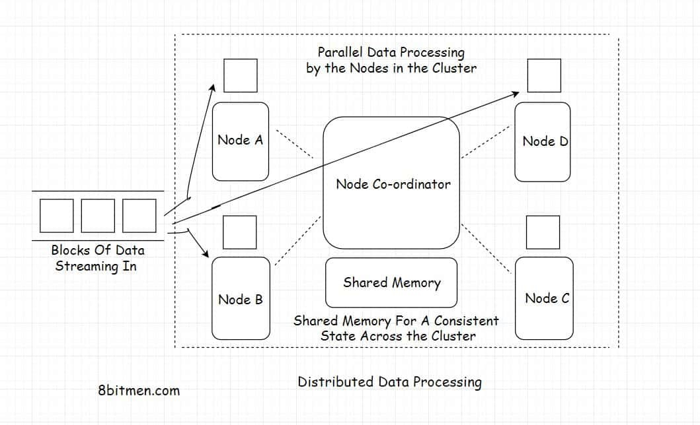

# Datová úložiště a nástroje pro Big Data (KI/BIG)

## Seminář 1 - Principy virtualizace a přehled nástrojů

### Samostudium

#### S1.1 - Veledata

Tento kurz je zaměřen na zpracování veledat pomocí efektivních nástrojů, na které samotné jazyky a standardní moduly/knihovny nestačí. Proto je nutné si jako první definovat, co jsou vlastně veledata, abyste měli na paměti, kdy je vhodné začít uvažovat o použití vyučovaných technologií.

Jedná z vhodných definic zní následovně: "Veledata (bigdata) jsou taková data, jejichž zpracování je problém sám o sobě." Tato data se vyznačují 3 vlastnostmi, ve kterých dosahují vysokých hodnot:
1. Volume (objem) - data mají v krátkém čase velkou kapacitu (GB, TB),
2. Variety (různorodost) - data mají různé datové formáty (text, audio, GPS souřadnice) a mohou být jak úplná, tak některé položky mohou chybět,
3. Velocity (rychlost) - data přicházejí velmi rychle (sekundy, mikrosekundy).

Někdo k těmto tzv. 3V přidává další 3V:
4. Veracity (důvěryhodnost) - spolehlivost na správné informace v datech (přesnost, zkreslení),
5. Variability (proměnlivost) - změna v hodnotách a formátu dat v čase,
6. Value (hodnota) - business hodnota získaná z analýzy dat.

Může se jednat o následující typy aplikací:
1. záznamy z velkých informačních systémů (cestování, trh akcií),
2. data z IoT (internet věcí) zařízení a senzorů,
3. příspěvky na sociálních sítích,
4. videherní servery a multimediální streamy.

Tato data se zpracovávají specializovanými nástroji. Mezi nejpoužívanější patří:
1. Apache Hadoop - systém pro práci s veledaty v dávkové podobě,
2. Apache Spark - systém pro práci s veledaty včetně streamů,
3. Apache Kafka - systém pro tvorbu streamovacích potrubí (stream pipeline),
4. NoSQL Databáze - databáze, které jsou efektivnější pro veledata než tradiční relační tabulkové databáze,
5. specializované moduly programovacích jazyků - moduly pro rychlé vektorové operace a strojové učení (numpy, pandas, scikit-learn).

#### S1.2 - Distribuované zpracování dat

Zpracování veledat vyžaduje velký výpočetní výkon. Výpočety se provádí na počítačích, kterým budeme říkat uzly. Zvyšování výkonu uzlů se provádí dvěmi způsoby:
1. vertikální škálování - změna součástek výpočetního uzlu za výkonější,
2. horizontální škálování - přidávání dalších výpočetních uzlů.

Vertikální škálování je velice drahé a brzo dojdeme i na samotnou technologickou mez výkonu uzlu. Proto v případě veledat musíme škálovat horizontálně. Každý uzel si vezme část z příchozích dat na starost ke zpracování. To přináší komplikace ve formě nutnosti data zpětně synchronizovat a složit do jednotného celku. To se nejčastěji řeší dedikovaným uzlem, kterýmu se říká master (pán). Ten má za úkol zadávat úkoly ostatním uzlům (slaves, otroci) a získávat od nich výsledky v požadové synchronicitě (časovém sledu).



Pro distribuované zpracování dat na uzlech je nutné psát sofistikované programy pro zpracování dat, které mají několik vrstev zpracování. Vzhledem k legislativě mohou některé data mít behaviorální charakter a jejich únik by porušil GDPR. Proto musí takové programy řídit i zabezpečení. Z dat musí také podniky nějakou hodnotu, která je typicky získaná z informací z dat, podle kterých se management informovaně rozhoduje. Aplikace tedy musí mít i komponenty pro analýzu dat (tvorba informací) a vizualizaci dat pro získání vhledu do problematiky. Kvalita dat také ovlivňuje celkovou analýzu a proto je nutné data často preprocesovat. Z toho důvodu existují celé pracovní rámce (frameworky) pro distribuované výpočty (Hadoop, Spark aj.). Programovat si vlastní distribuované výpočtní systémy by bylo neskutečně náročné.


#### S1.3 - Virtualizované kontejnery

V oboru softwarového inženýrství se dlouho řešil proces optimalizace nasazení a homogenního vývoje (celý tým vývojářů má stejnou platformu na které staví svůj kód). Řešením bylo využít kontejnerizace. V praxi se virtualizují (odproštění se od hmotné podstaty) aplikace na úrovni samotných aplikací nebo operačních systémů. Takové virtualizované aplikace jsou izolovány od všech ostatních náležitostí hmotného světa. Tím se myslí:
* Aplikace netuší, jaké jsou skutečné fyzické prostředky počítače. Přidělená operační paměť, procesorový čas a místo na pevném disku může být jen dílčí část skutečných výpočetních prostředů.
* Aplikace netuší, jaký je reálný hostitelský operační systém. Aplikace může běžet v Linuxu, avšak na skutečném serveru je Windows.
* Aplikace netuší, jaké další aplikace kromě jí známých skutečně běží na počítači.

Takové izolované aplikace v kontejnerech mohou být pak využity pro nezávislý běh na libovolném počítači a serveru. Neměl by existovat problém se závislostmi, jelikož aplikace mají všechny závislosti v jejich kontejneru již zabudované.

Základní filosofií nástrojů řešící virtualizaci kontejnery je trojice aktivit v procesu virtualizace:
1. sestav (build) - kontejner je univerzální programový balíček, který je sestaven tak, aby byl platformově agnostický (nezávislý)
2. doruč (ship) - kontejner je doručen zákazníkovi jako izolovaný soubor nebo jako odkaz na repozitáři, který může snadno stáhnout a sestavit
3. spusť (run) - sestavený kontejner je snadné spustit a měl by běžet na jakékoliv platformě, kde se nachází aplikace pro správu kontejnerů

Jejich využití ve veledatech je takové, že potřebujeme snadno vytvořit homogenní platformu, na které poběží vertikálně škálované aplikace. Virtualizace pomocí kontejnerů tento problém řeší. Kontejnery jsou platformově agnostické jednotky, takže nepotřebuji homogenní platformu, lze je snadno orchestrovat (starat se o životní cyklus a vytvářet nové instance podle aktuální vytíženosti).

#### S1.4 - Docker

Docker je v aktuální době nejpopulárnější virtualizační nástroj pro kontejnery. Jeho způsob sestavování obrazů (předloh) pro kontejnery se stal standardem, kterému říkám OCI. Důležité je pochopit následující terminologii:
1. Obraz (image) - předloha pro kontejner
2. Kontejner (container) - instantizovaný obraz do spustitelné izolované aplikace

Docker se skládá z několika elementů:
1. Sestavovač (Builder) - čte sestavovací soubory (Dockerfiles) a na základě jejich instrukcí sestavuje obraz aplikace
2. Klient (Client) - umožňuje komunikace uživatele s obrazy, kontejnery a motorem Dockeru
3. Démon (Daemon) - spravuje běh kontejnerů a ukládá obrazy na pevný disk
4. Motor (Engine) - spravuje data kontejnerů a manipuluje na základy požadavků klienta s kontejnery
5. Událostní sběrnice (Event bus) - poskytuje požadované informace o událostech z kontejnerů
6. Registr (Registry) - ukládá obrazy a poskytuje rozhraní pro práci s nimi
7. Tabulka (Table) - obsahuje odpovědnosti všech zmíněných elementů Dockeru

Při používání Dockeru jako kontejnerizační aplikace byste měli dodržovat následující zásady:
1. Aplikace jsou vrstvené - budování obrazů se děje na základě na sebe naskládaných vrstev. Pokud se změní obsah jedné vrstvy, není nutné znovusestavovat všechny vrstvy.
2. Jedna aplikace v kontejneru - v kontejneru by měla být vzdy jedna aplikace (např. webová aplikace ve Flask) a ta by měla v případě potřeby komunikovat s aplikacemi v jiných kontejnerech (např. PostgreSQL).
3. Aplikace jsou bezestavové - kontejnery by měly být efemérní (prchavé, angl. ephemeral), tzn. neměl by být problém s jejich zastavením, zničením, znovuvytvořením a nasazením bez většího úsilí. Nejlepší způsob jak toto zaručit je psát bezestavové aplikace. Data by měly být umístěné mimo aplikační kontejner (interní nebo cloudová databáze).

Více se o Dockeru můžete dočíst například [ZDE](https://delftswa.github.io/chapters/docker/)


### Cvičení

#### C1.1 - Docker

Pojďme si zkusit spustit Docker obraz do Docker kontejneru a využívat ho jako jednoduchý virtuální linuxový počítač. Do spuštěného kontejneru se připojíme přes vybraný komunikační způsob (Socker, TCP/TLS, SSH tunel) a budeme mu zadávat příkazy.

Nejprve si nainstalujte Docker a spusťte Docker Desktop aplikaci. [ODKAZ](https://www.docker.com/products/docker-desktop/)

Poté si otevřete příkazovou řádku (např.: ve VS Code, CMD, PowerShell, GitBash, Terminál) a vyzkoušíme, že příkazová řádka umí volat Docker klienta. Pokud se objeví výpis s verzí, pak je vše v pořádku.
```
docker version
```

Teď si vyzkoušíme stáhnout nějaký obraz z Dockerhubu, což je databáze různých obrazů. Například můžeme stáhnout následující obraz, který slouží jako Hello World pro docker [ZDE](https://hub.docker.com/_/hello-world) příkazem:
```
docker pull hello-world
```

Obraz teď spustíme v kontejner pomocí příkazu:
```
docker run hello-world
```

Všimněte si v aplikaci Docker Desktop, jak Vám tam přibyl obraz i kontejner. Smažte kontajner a zkuste spustit obraz hello-world v kontajner a prohlídněte si výpis přímo v Docker Desktop. Poté smažte v Docker Desktop rozhraní, jak kontejner, tak obraz.

Pojďme se podívat na některé možnosti spouštění obrazů. Následující příklad spustí obraz apache serveru v detached modu (na pozadí) a na portu 8800, na který je přesměrován port 80 z obrazu. Ačkoliv jsme tento obraz nestáhli jako v předchozím případě, tak Docker ho nalezne na Dockerhubu a stáhne ho za nás.
```
docker run -d -p 8800:80 httpd
```

Pro vyzkoušení funkčnosti běžícího kontejneru můžeme zkusit curlem stáhnout data z index stránky apache serveru (Terminal, Git Bash)
```
curl localhost:8800
```
nebo si stránku můžeme prohlédnou ve svém prohlížeči na adrese http://localhost:8800.

Kontejnerů může být spuštěno víc naráz. Zkuste si spustit další dva apacher servery na jiných portech a poté následujícím příkazem vypsat všechny aktuálně běžící kontajnery.
```
docker run -d -p 8801:80 httpd
docker run -d -p 8802:80 httpd
docker ps
```

Altenativně můžeme použít pro výpis běžících kontejnerů modernější příkaz:
```
docker container ls
```

Jelikož jsme nespecifikovali jejich jména, tak jsou náhodně vygenerovaná. Prohlídněte si běžící kontajnery i v Docker Desktop. Prohlédněte si také obrazy pro ujištění, že chápete řádně rozdíl mezi kontajnerem a obrazem. Obraz je předloha a kontajner je běžící instance. To může občas mást v případech, kdy docker za Vás stahuje obraz a rovnou ho spouští v kontajner.

Pojďme zastavit kontajnery pomocí příkazové řádky. 
```
docker stop [jméno kontejneru nebo id kontejneru]
```

Poté pojďme kontajnery smazat. Nejprve je vypíšeme a pak je smažeme podle jejich ID (docker container ukazuje jen běžící kontajnery, proto příkaz ls -all).
```
docker container ls --all
docker rm  [jméno kontejneru nebo id kontejneru]
```

Dále pojďme smazat jejich obrazy. Nejprve si je vypíšeme a poté je smažeme.
```
docker images
docker rmi [jméno repository nebo id obrazu]
```

Pojďme si ještě zkusit stáhnout obraz operačního systému Ubuntu, který spustíme interaktivním způsobem pomocí terminálu (příznak it) a konkrétně spustíme binární program bash a smažeme ho po ukončení běhu (kontejner, obraz se nesmaže). Můžete si v něm pak trénovat Vaše dovednosti v Linuxu. Podívejte se také na to, že kontejner se smazal v Docker Desktop (nebo pomocí docker container ls --all).
```
docker run --rm -it ubuntu bash
```

Pokud bychom chtěli spustit nějaký kontejner na pozadí a poté mu zadávat příkazy nebo se do něj připojit, tak můžeme využít příkazu exec. Pojďme zkusit spustit příkazovou řádku v běžícím kontejneru pro Apache server (což simuluje typický případ užití, kdy běží server s aplikací a vy ho chcete za běh diagnostikovat).
```
docker run -d -p 8800:80 httpd
docker exec -it [název kontejneru] bash
```

Zkuste schválně přepsat za běhu kontejneru soubor na cestě /usr/local/apache2/htdocs/index.html a podívat se do prohlížeče na výstup apache serveru (použijte příkaz echo a přesměrujte jeho výstup do souboru).

#### C1.2 - Dockerfile

Doteď jsme pracovali s cizími obrazy, které pro nás někdo připravil a my je jen sestavovali a spouštěli. Zkusme si teď vybudovat vlastní obraz. To se provádí prostřednictvím souboru, kterém se říká Dockerfile.

Pojďme si nejprve vytvořit jednoduchou webovou aplikaci ve frameworku Flask. Do adresáře `src` v aktuálním pracovním adresáři vložíme následující kód do soubory `app.py`, který při žádosti na koncovém bodu "/" vrátí webovou stránku s nadpisem Ahoj. Aplikaci spustíme v Docker kontejneru na portu 5000 a na adrese 0.0.0.0.

```python
from flask import Flask

app = Flask(__name__)

@app.route("/")
def index():
  return "<html><body><h1>Ahoj</h1></body></html>"

if __name__ == "__main__":
  app.run(host="0.0.0.0", port=5000)
```

Dále v aktuálním pracovním adresáři vytvoříme soubor `requirements.txt`, který bude sloužít pro instalaci modulu Flask do Docker obrazu. Do souboru napíšeme následující závislost:
```
flask
```

Následující ukázka je Dockerfile, který stáhne minimalizovaný Linux Alpine (5 MB) s předinstalovaným interpretrem python3, použije ho jako základ do kterého nainstaluje webový framework Flask, nakopíruje do jeho pracovního adresáře /app zdrojové soubory a requirements soubor se závislostma pro správce balíku pythonu (Pip), nainstaluje závislosti a spustí webovou aplikaci.

```
#stáhni z dockerhubu tento základní obraz
FROM python

#vytvoř v obrazu pracovní adresář v rootu s názvem app a přesuň se do něj (kombinace mkdir a cd)
WORKDIR /app

#zkopíruj z mého pracovního adresáře na mém disku soubor requirements.txt se závislostmi pythonu a vlož ho do pracovního adresáře obrazu
COPY requirements.txt .

#spusť v obrazu správce balíku pip a nainstaluj závislost z requirements souboru
RUN pip install -r requirements.txt

#zkopíruj z mého pracovního adresáře na mém disku obsah složky src a zkopíruj ho do pracovního adresáře v obrazu (/app)
COPY src/ ./

#spusť přes příkazovou řádku naší flask aplikaci na adrese 0.0.0.0
CMD [ "python", "app.py"]
```

Tento soubor se pomocí příkazu ```docker build .``` sestaví ve spustitelný obraz. Tečka na konci znamená, že Dockerfile je v aktuálním pracovním adresáři. Jinak tam uveďte cestu k Dockerfilu.

Pojďme si vysvětlit základní instrukce pro Dockerfile:
* FROM - první příkaz Dockerfilu, vybírá základní obraz, na kterým staví další vrstvu.
* MAINTAINER - metainformace o tom, kdo je autor obrazu
* RUN -spouští zadaná příkaz v shellu operačního systému (bash, cmd, ps, ...)
* CMD - musí být jako jediný příkaz v Dockerfilu a představuje spouštěcí bod aplikace s argumenty, neslouží pro nastavení a instalace závislostí jako RUN
* LABEL - přidává dodatečné metainformace ve formě dvojic klíč:hodnota
* EXPOSE - nastavuje naslouchání kontejneru na specifický port
* ENV - nastavuje proměnné prostředí ve formě klíč:hodnota, typicky pro loginy, hesla a jiná data, která nemají být v kódu odkryta
* COPY - kopíruje data (soubory a adresáře) z lokálního disku do obrazu
* ADD - stejně jako příkaz COPY, ale umožňuje i adresovat data pomocí URL
* ENTRYPOINT - nastavení všech argumentů příkazové řádky, které se spustí při spuštění obrazu (přepisují ty, nastavené v příkazu CMD)
* VOLUME - slouží pro vytvoření sdíleného diskového místa mezi kontejnerem a hostitelem (mohu tak snadno vyvíjít do kontejneru a zasílat tam transparentně změny ze svého disku)
* USER - nastaví uživatelské jméno nebo uživatelské UID k obrazu
* WORKDIR - vytvoří pracovní adresář v obrazu pro příkazy jako RUN, CMD, ENTRYPOINT, COPY a ADD
* ARG - argumenty, které slouží Dockeru pro tvorbu obrazů, nemělo by být použito pro tajná data (secrets) - pro ty máme ENV
* ONBUILD - přidává instrukci typu spoušť (trigger), které se spustí, až bude obraz použit jako bázová vrstva pro jiný obraz.
* STOPSIGNAL - nastaví systémový signál pro násilné ukončení kontejneru (kill signal - SIGKILL).
* HEALTHCHECK - nastavení procesu měření zdráví kontejneru pomocí příkazů příkazové řádky. Pokud test opakovaně selže, tak je kontejner považován za nemocný.
* SHELL - umožňuje nastavit základní shell pro příkazy typu CMD.

Hlubší přehled příkazů naleznete [ZDE](https://kapeli.com/cheat_sheets/Dockerfile.docset/Contents/Resources/Documents/index)

#### C1.3 - Dockerhub

Dockerhub je úložiště dockerobrazů, které si můžete stáhnout příkazem ```docker pull [název obrazu]``` do svého projektu a používat obraz jako běžící kontejner, nebo můžete obraz využít jako základní vrstvu pro váš vlastní obraz. Nahrané obrazy na Dockerhubu jsou nahrány různými společnostmi a komunitou. Vy sami si můžete na dockerhub nahrát vlastní obraz, který si ostatní mohou stáhnout a spustit nebo vybudovat nad ním vlastní aplikaci. Na Dockerhubu se musíte nejprve registrovat.

Když sestavujete obraz, který chcete nahrát na dockerhub, tak by postup měl být následující:
* sestavte si z dockerfilu obraz: ```docker build -t [váš dockerhub login]/[zvolený název obrazu] .```
* vyzkoušejte lokální běh kontejneru z obrazu: ```docker run [váš dockerhub login]/[zvolený název obrazu]```
* nahrajte obraz na dockerhub: ```docker push [váš dockerhub login]/[zvolený název obrazu]```
* zkontrolujte nahrání obrazu na dockerhubu
* stažení pak kdokoliv provede příkazem: ```docker pull [váš dockerhub login]/[zvolený název obrazu]```

#### C1.4 - Docker-compose

V praxi potřebuji více aplikací (služeb) aby tvořilo můj systém. Řešením by bylo sestavení obrazu mé aplikace a spuštění a následně v jiné instance (nebo při detached modu klidně na popředí) stáhnout další požadované obrazy s aplikacemi (například NoSQL databáze typu Mongo, Neo4J, Redis aj.). To je v praxi dost nepohodlné. Daleko lepší by bylo vytvořit jeden soubor, který mi všechny mé vlastní služby sestaví z Dockerfilů a ostatní stáhne z dockerhubu. Staženým službám nastaví tajemství (loginy, hesla) a další konfigurační informace (porty, závislosti) a spustí výsledné sestavené obrazy v kontejnery. Takovou aplikací je právě docker-compose, která je nově součástí Dockeru samého.

Pojďme se podívat na docker-compose.yml souboru, který sestaví vlastní flask aplikaci a stáhne 3 další obrazy (Redis, MongoDB, Neo4J). Jedná se o minimální nastavení služeb. Zbytek si musíte dohledat na příslušných stránkách samotných obrazů na Dockerhubu.
* [Redis](https://hub.docker.com/_/redis)
* [MongoDB](https://hub.docker.com/_/mongo)
* [Neo4J](https://hub.docker.com/_/neo4j)

```
version: '3'
services:
  flask:
    build: .
    container_name: flask
    ports:
      - "5000:5000"
    volumes:
      - ./src:/app
    depends_on:
      - redis

  redis:
    image: redislabs/redismod
    container_name: redis
    ports:
      - "6379:6379"

  mongodb:
    image: mongo:latest
    environment:
      MONGO_INITDB_ROOT_USERNAME: admin
      MONGO_INITDB_ROOT_PASSWORD: admin
    ports:
      - 27017:27017

  neo4j:
    image: neo4j:latest
    ports:
      - "7474:7474"
      - "7687:7687"  
```
 
Tento soubor se spustí příkazem ```docker-compose up``` pokud je docker-compose.yml soubor v aktuálním pracovním adresáři terminálu. Měli byste vidět v Docker desktopu sestavený zásobník (stack) kontejnerů a minimálně 4 obrazy (4 služby z docker-compose souboru a případně vaší vlastní další).

Rozeberme si příkazy tohoto Docker-compose.yml souboru.
* version - jaká verze docker-composu se využívá
* services - pod tento příkaz se definují všechny služby výsledného zásobníku (názvy služeb jsou na nás)
* build - pro služby, které se sestavují z Dockerfilu, a příkaz udává cestu k příslušnému Dockerfilu
* container_name - jak se bude jmenovat sestavená kontejner služby
* ports - na jakých portech uvidíme na hostitelském počítači (první číslo) výstup portu služby (druhé číslo)
* volumes - propojí souborové systémy v hostitelském počítači (první cesta) se souborovým systémem v kontejnery služby (druhá cesta)
* depends_on - nastavení závislosti služby na jiné, nejprve se musí spustit služba, na které je aktuální závislá, tím se zabrańuje například tomu, že by se spustila webová aplikace pokud selže spuštění databáze (lze například ještě specifikovat příznakem condition, že služba musí být také zdravá)
* image - stáhne obraz z dockerhubu a sestaví ho v kontejner
* environment - nastavení proměnných prostředí (loginy, hesla aj.)

Důležité jsou ještě některé užitečné příkazy konzolového rozhraní docker-composu. Obecně jsou ve formátu ```docker-compose [příznaky] [příkaz] [argumenty]```. Celý přehled naleznete [ZDE](https://docs.docker.com/compose/reference/):
* build - sestaví nebo znovusestaví služby
* create - vytvoří kontejnery pro služby
* start - zapne služby
* up - vytvoří a zapne služby (create + start najednou)
* pause - pozastaví služby
* unpause - odzastaví služby
* restart - restartuje kontejnery služeb
* stop - zastaví služby
* down - zastaví a odstraní služby
* exec - spustí příkaz ve službě
* cp - kopíruje soubory mezi hostujícím serverem a službou 
* logs - vypíše výstup služby
* port - vypíše veřejné nastavené porty (občas se hodí, když jste zapomněli nastavení a nechcete si prohlížet docker-compose soubor)

Pokud chcete po spuštění příkazem sestavovacího procesu tyto příkazy interaktivně využívat, tak musíte spustit docker-compose v detached režimu ```docker-compose up -d```.

Posledním důležitým poznatkem jsou sítě (network). Kromě závislosti spuštění obrazu v kontejner na základě existence nebo zdravého stavu jiného (depends_on) lze závislost kontejnerů provázat tím, že je dáme do společné sítě, kde na sebe vidí přeš šifrovaný síťový tunel. V terminologii docker síťování existuje několik důležitých termínů:
* síťové pískoviště (network sandbox) - izolované virtuální síťové prostředí pro komunikaci docker kontejnerů
* koncový bod (endpoint) - body komunikace s kontejnerem (IP, MAC, DNS adresy)
* síťový ovladač (network driver) - mechanismus síťové komunikace (bridge, host, none, overlay, macvlan), určuje jak bude docker síť řešena
* docker motor (docker engine) - spravuje síť s různými network drivery
* most (bridge) - soukromá síť v hostitelském počítači, kontejnery mají v takové síti vlastní IP adresu přes kterou komunikují; jedná se o typ ovladače
* overlay - důležitý ovladač pro Docker shluky (docker swarm), který řídí komunikaci shluků s obrazy
* macvlan - ovladač zjednodušující komunikaci obrazů pomocí přiřazení MAC adresy kontejnerům

Více se dozvíte [ZDE](https://www.edureka.co/blog/docker-networking/).

V našem předchozím příkladě samozřejmě také vznikla síť, jen jsme ji sami nespecifikovali. Po spuštění se vytvořila síť s implicitním názvem a kontejnery spolu komunikují pomocí názvu služeb. Pojďme si ukázat příklad docker-composu, kde si sami specifikujeme síť. V tomto kódu je upravena struktura projektu tak, že React (javascriptový pracovní rámec) se stará o zobrazení dat aplikace. Tato data mu zasílá flask, který je získává z databází. Flask potřebuje komunikovat s databázemi, ale React pouze s Flaskem. Proto jsou vytvořeny dvě sítě - frontend a backend. Flask je součástí frontendu (komunikace s React) a backendu (komunikace s databázemi), ale React je jen součástí frotendu (komunikace s Flask).

```
version: '3'
services:

  react:
    build: Dockerfile-react
    container_name: react
    volumes:
      - ./frontend:/code/frontend
    depends_on:
      - flask
    networks:
      - frontend

  flask:
    build: Dockerfile-flask
    container_name: flask
    ports:
      - "5000:5000"
    volumes:
      - ./backend:/code/backend
    depends_on:
      - redis
      - mongodb
      - neo4j
    networks:
      - backend
      - frontend

  redis:
    image: redislabs/redismod
    container_name: redis
    ports:
      - "6379:6379"
    networks:
      - backend

  mongodb:
    image: mongo:latest
    environment:
      MONGO_INITDB_ROOT_USERNAME: admin
      MONGO_INITDB_ROOT_PASSWORD: admin
    ports:
      - 27017:27017
    networks:
      - backend

  neo4j:
    image: neo4j:latest
    ports:
      - "7474:7474"
      - "7687:7687"
    networks:
      - backend

networks:
    backend:
    frontend:
```