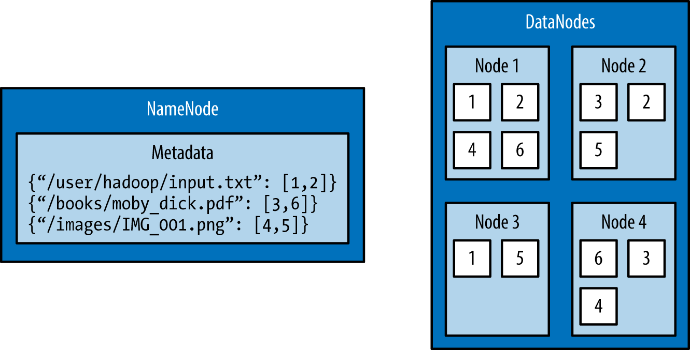

# Datová úložiště a nástroje pro Big Data (KI/BIG)

## Seminář 5 - Příprava Hadoop a práce s daty (HDFS, HiveQL)

### Samostudium

#### S5.1 - Hadoop

Hadoop je open-source framework vyvinuty v jazyce Java navržený pro distribuované ukládání a zpracování velkého objemu dat. Využívá se v big data aplikacích a umožňuje práci s obrovskými datovými sadami, které by tradiční systémy nebyly schopny efektivně zpracovat (terabyta až pentabyty dat). Hadoop používají společnosti jako Facebook, Yahoo, Netflix nebo Spotify.

Klíčové komponenty Hadoopu jsou:
* HDFS (Hadoop Distributed File System) – distribuuje data přes více uzlů (serverů), což umožňuje ukládat obrovské množství dat na levnější hardware. HDFS rozděluje soubory do bloků a každý blok ukládá na různých uzlech, aby zajistil redundanci a odolnost proti selhání.
* MapReduce – model a nástroj pro zpracování velkých dat paralelně na více uzlech. Map fáze rozděluje úlohy na menší části, které se provádí paralelně na více uzlech. Reduce fáze shromažďuje, zpracovává a kombinuje výstupy z fáze Map do závěrečného výstupu.
* YARN (Yet Another Resource Negotiator) – systém pro správu zdrojů, který umožňuje spouštění a řízení různých aplikací v rámci clusteru Hadoop a poskytuje tím kontrolu nad distribucí výpočetních úloh.
* Hadoop Common – knihovny nástrojů, která usnadňujě distribuovanou práci s daty.

#### S5.2 - Hadoop Distributed File System (HDFS)

HDFS je distribuovaný souborový systém Hadoopu, který umožňuje práci s veledaty tím, že data rozděluje na menší části, které jsou ukládány na různých uzlech (Datové uzly, Data-nodes) v Hadoop klastru. HDFS je vysoce škálovatelný a odolný proti chybám. 

HDFS vznikl na základě GFS (Google File System), o kterém se můžete dočíst v originálním článku od Google [ZDE](https://research.google/pubs/the-google-file-system/).

V HDFS jsou soubory rozděleny na bloky o pevné velikosti a tyto bloky jsou rozděleny mezi datové uzly. Soubor tedy nemusí nutně být uložen na jednom fyzickém počítači. Bloky jsou duplikovány a rozprostřeny do klastru (standardně má každý blok 3 reprezentace v klastru) pro zajištění dostupnosti dat v případě výpadku uzlu klastru.

Z architektonického hlediska Hadoop klastru jsou důležité dva procesy:
1. NameNode - běží typicky na dedikovaném uzlu a udržuje metadata o celém souborovém systému Hadoopu - názvy souborů, práva k přístupu, umístění každého bloku na klastru. Také udržuje informace o tzv. replikačním faktoru (kolik je aktuálně dostupných duplicit datového bloku v klastru). Všechny tyto informace jsou uloženy v operační paměti pro rychlý běh klastru. Vhodnou strategií je existence záložního NameNodu v případě selhání hlavního NameNodu.
2. DataNode - tyto procesy běží na mnoha fyzických serverech a ukládají bloky dat souborů. Pokud tyto servery selžou, tak Hadoop dále pokračuje v běhu a NameNode replikuje ztracené bloky.



Hadoop se ovládá pomocí skriptu v terminále s názvem HDFS. Nejčastějším příkazem skriptu je využití příkazu DFS, který umožňuje používat základní Linuxové operace pro práci se souborovým systémem. Mezi nejzákladnější příkazy DFS patří (znáte z Linuxu):
* `hdfs dfs -ls [HDFS cesta]`: vypíše obsah HDFS systému (na nově vytvořeném klastru bude prázdný narozdíl od FS na fyzickém serveru)
* `hdfs dfs -mkdir [cesta]`: vytvoří adresář
* `hdfs dfs -put [lokální cesta] [HDFS cesta]`: nahrání dat do HDFS systému z lokálního souborového systému
* `hdfs dfs -cat [HDFS cesta]`: vypíše obsah souboru v HDFS
* `hdfs dfs -get [HDFS cesta] [lokální cesta]`: stáhne data z HDFS na lokální disk

Pro komunikaci s HDFS existuje pythonovský modul Snakebites od Spotify, který ale bohužel funguje jen pro Python2.

#### S5.3 - Map-Reduce framework

Map-Reduce je programovací model, tedy způsob, jak uvažujeme při programování nad skládáním funkcí programu. Tento model je vysoce efektivní pro zpracování veledat na distribuovaném výpočetním prostředí (klastr serverů). Skládá se ze tří fází (i když název hovoří o dvou):
1. Mapování - vstupní data se rozdělí na paralelně zpracovávané bloky, na každý blok je aplikována mapující funkce, která transformuje data na klíč-hodnota dvojice
2. Rozdělení a seřazení - data ve formě klíč-hodnota dvojic se seskupují pokud mají identické klíč a řadí pro další zpracování
3. Redukce - redukční operace ja aplikována na seskupené bloky (mají stejný klíč) a použije se na ně agregační funkce (suma, průměr apod.), výstupem je soustava dvojic klíč-hodnota, které jsou výsledky agregace nad seskupenými dvojicemi

Tento přístup ke zpracování zajišťuje snadné paralelní rozdělení výpočtu, které má za následek škálovatelnost a odolnost proti výpadku. Pokud vypadne výpočetní uzel, jiný může nahradit jeho funkci a dopočítat chybějící.

Tento výpočetní model je zajištěn komponentou Hadoopu s názvem YARN, který alokuje výpočetní zdroje a zajišťuje paralelizaci úlohy.

Pro Python existuje modelu MrJob, který umožňuje psát a spouštět MapReduce úlohy přímo v jazyce Python oproti pro Hadoop nativní Javě. Ukázka kódu v MrJob:
```
from mrjob.job import MRJob

class WordCount(MRJob):
    def mapper(self, _, line):
        for word in line.split():
            yield (word, 1)

    def reducer(self, word, counts):
        yield (word, sum(counts))

if __name__ == '__main__':
    WordCount.run()
```

#### S5.4 - HiveQL (Hive Query Language)

HiveQL je dotazovací jazyk nástroje Apache Hive, který umožňuje dotazovat se analytovat data uložená v HDFS. Jazyk je podobný jazyku SQL, což si můžeme ukázat na následujícím příkladu:
```
SELECT country, COUNT(*) as user_count
FROM users
GROUP BY country;
```
HiveQL tento dotaz přeloží do MapReduce úlohy a spustí. Tímto způsobem je možné snadno vytvářet různé reporty v oblasti dolování veledat z Hadoop klastru.

Hive dotazy je možné pouštět pomocí Python Knihovny PyHive.

#### S5.5 - Správa pracovních toků


### Cvičení

#### C5.1 - Příprava Hadoop([ZDROJ](https://cjlise.github.io/hadoop-spark/Setup-Hadoop-Cluster/))

Udělejme si klon tohoto repozitáře (nebo jsem pro jistotu provedl zálohu v tomto adresáři na Githubu).
```
https://github.com/big-data-europe/docker-hadoop
```
a příkazem `docker-compose up` vytvoříme zásobník kontejnerů pro Hadoop platformu.

Ověření funkčnosti provedeme tím, že se podíváme na Name-node na adrese: `http://localhost:9870/`.

**Úkol 1 - Rozdělení souboru na bloky**
Nahrajte si na Hadoop nějaký soubor a pozorujte na Name-nodu rozdělení souboru na bloky na jednom datovém uzlu. Najděte, kde taková informace je ve webovém rozhraní.

**Řešení:**
1. Pomocí docker příkazu cp nahraju do NameNode nějaký soubor nebo soubory z lokálního disku počítače: `docker cp [soubor] namenode:/tmp`
2. Přihlásím se na NameNode: `docker exec -it namenode bash` a nahraju soubor z lokálního disku HeadNode do HDFS:
```bash
hadoop fs -mkdir -p mojedata
hdfs dfs -put ./tmp/* mojedata
``` 
3. Prohlédnu si ve webovém UI na adrese `http://localhost:9870/`. V navigační liště vyberu Datanodes a dole vidím hash otisk datového uzlu. Zde bude napsáno, kolik bloků je na datovém uzlu vytvořeno a kolik místa zabírají.

Soubor by šlo nahrávat i přes webové UI.
1. Přihlásím se do webového dashboardu na adrese (pokud jste neměnili porty) `http://localhost:9870/` a nahoře v navigační liště vyberu záložku Utilities -> Browse the file system
2. Najdu tlačítko pro nahrání souborů z lokálního disku (Upload files) a nahraju tam libovolný soubor. Bohužel mi toto řešení nefunguje. Třeba přijdete na to, jak to zprovoznit. Problém je s právy a doménou, což lze vyřešit pravděpodobně přidáním hostname: localhost pro všechny kontejnery v docker-compose.yml

**Úkol 2 - Přidání jednoho datového uzlu**
Přidejte další 2 datové uzly do docker-compose a sledujte rozdělení na bloky mezi Datové uzly.

**Řešení:**

Nejprve budeme muset změnit docker-compose.yml soubor. Přidáme do něj další instance datového uzlu.
```
version: "3"

services:
  namenode:
    image: bde2020/hadoop-namenode:2.0.0-hadoop3.2.1-java8
    container_name: namenode
    restart: always
    ports:
      - 9870:9870
      - 9000:9000
    volumes:
      - hadoop_namenode:/hadoop/dfs/name
    environment:
      - CLUSTER_NAME=test
    env_file:
      - ./hadoop.env

  datanode1:
    image: bde2020/hadoop-datanode:2.0.0-hadoop3.2.1-java8
    container_name: datanode1
    restart: always
    volumes:
      - hadoop_datanode1:/hadoop/dfs/data
    environment:
      SERVICE_PRECONDITION: "namenode:9870"
    env_file:
      - ./hadoop.env

  datanode2:
    image: bde2020/hadoop-datanode:2.0.0-hadoop3.2.1-java8
    container_name: datanode2
    restart: always
    volumes:
      - hadoop_datanode2:/hadoop/dfs/data
    environment:
      SERVICE_PRECONDITION: "namenode:9870"
    env_file:
      - ./hadoop.env

  datanode3:
    image: bde2020/hadoop-datanode:2.0.0-hadoop3.2.1-java8
    container_name: datanode3
    restart: always
    volumes:
      - hadoop_datanode3:/hadoop/dfs/data
    environment:
      SERVICE_PRECONDITION: "namenode:9870"
    env_file:
      - ./hadoop.env
  
  resourcemanager:
    image: bde2020/hadoop-resourcemanager:2.0.0-hadoop3.2.1-java8
    container_name: resourcemanager
    restart: always
    environment:
      SERVICE_PRECONDITION: "namenode:9000 namenode:9870 datanode1:9864 datanode2:9864 datanode3:9864"
    env_file:
      - ./hadoop.env

  nodemanager1:
    image: bde2020/hadoop-nodemanager:2.0.0-hadoop3.2.1-java8
    container_name: nodemanager
    restart: always
    environment:
      SERVICE_PRECONDITION: "namenode:9000 namenode:9870 datanode1:9864 datanode2:9864 datanode3:9864 resourcemanager:8088"
    env_file:
      - ./hadoop.env
  
  historyserver:
    image: bde2020/hadoop-historyserver:2.0.0-hadoop3.2.1-java8
    container_name: historyserver
    restart: always
    environment:
      SERVICE_PRECONDITION: "namenode:9000 namenode:9870 datanode1:9864 datanode2:9864 datanode3:9864 resourcemanager:8088"
    volumes:
      - hadoop_historyserver:/hadoop/yarn/timeline
    env_file:
      - ./hadoop.env
  
volumes:
  hadoop_namenode:
  hadoop_datanode1:
  hadoop_datanode2:
  hadoop_datanode3:
  hadoop_historyserver:
```

Poté zopakujeme proces nahrávání souboru.
1. Pomocí docker příkazu cp nahraju do NameNode nějaký soubor nebo soubory z lokálního disku počítače: `docker cp [soubor] namenode:/tmp`
2. Přihlásím se na NameNode: `docker exec -it namenode bash` a nahraju soubor z lokálního disku HeadNode do HDFS:
```bash
hadoop fs -mkdir -p mojedata
hdfs dfs -put ./tmp/* mojedata
``` 
3. Prohlédnu si ve webovém UI na adrese `http://localhost:9870/`. V navigační liště vyberu Datanodes a dole vidím hash otisk datových uzlů. Zde vidíte efekt replikace. Pokud budete mít 3 datové uzly jako já a implicitní duplikace jsou 3 bloky, tak všechny 3 datové uzly budou mít stejný počet bloků (originál + dvě repliky).

**Úkol 3 - Simulace výpadku DataNode a dostupnost dat**
Shoďte jeden DataNode a sledujtem co se děje s daty a jejich replikací. 

**Řešení:**
To můžete provést buď v Docker Desktop rozhraní nebo přes příkaz: `docker stop datanode1`, kde místo datanode1 můžete samozřejmě vybrat jakýkoliv jiný. Poté si dejte 10 minut přestávku a ve webovém UI zjistíte, že je block registrován HeadNodem jako nefungující (implicitní doba). Tato doba je nastavitelná v konfiguračních souborech Hadoopu. Pokud si přidáte ještě jeden DataNode do klastru, tak uvidíte dynamiku duplikace bloků na 4. DataNode.

Když si poté vyzkoušíte stáhnout data z klastru, tak to bude fungovat. Dělat to asi nemusíte, jelikož rovnou vidíte ve webovém UI, že data na DataNodes existují. Pro jistotu uvádím příkazy.

```bash
docker exec -it namenode bash
hdfs dfs -get mojedata/* ./tmp/
```

**Úkol 4 - Co dělají ostatní uzly?**
Celou dobu jsme pracovali pouze s HeadNode a DataNodes. V Dockeru vidíte spuštěné další uzly:
* resourcemanager
* historyserver

Zjistěte, jaký je úkol těchto dvou uzlů.

**Řešení:**
* resourcemanager - Udržuje přehled o dostupných výpočetních zdrojích na všech uzlech v clusteru a efektivně je rozděluje mezi různé úlohy na základě potřeb a priorit (mozek YARNu).
* historyserver - Slouží k uchovávání informací o dokončených úlohách, které už nejsou sledovány ResourceManagerem nebo JobTrackerem, a umožňuje uživatelům tyto informace zpětně analyzovat.

#### C5.2 - Snakebite([ZDROJ](https://www.oreilly.com/content/hadoop-with-python/))

Občas byste potřebovali pracovat s Hadoop HDFS z nějakého skriptu než přes příkazovou řádku. Nejjednodušší možností pro jazyk Python je využít knihovnu Snakebite. Tato knihovna byla vyvinuta firmou Spotify, ale bohužel funguje jen pro Python2. Přesto existuje port do Pythonu3, který si nainstalujeme do virtuálního prostředí. Při spuštění skriptu by Vám však házela knihovna technický problém se závislostí na knihovně protobuf. Musíme downgradovat protobuf z verze 5 (v době psaní tohoto textu) na 3.20.

```bash
pip install snakebite-py3
pip install protobuf==3.20.*
```

Tato knihovna je však velmi omezená v tom, že neumí nahrávat soubory do HDFS. Může pouze vytvářet složky, přejmenovávat, vypisovat obsah souborů a stahovat data na lokální disk. Nahrávání budete muset udělat v nějakém bash skriptu.

```python
from snakebite.client import Client

client = Client('localhost', 9000)
for l in client.ls(['/']):
   print(l)

for p in client.mkdir(['/foo/bar', '/input'], create_parent=True):
   print(p)

for p in client.delete(['/foo', '/input'], recurse=True):
   print(p)

for f in client.copyToLocal(['/input/input.txt'], '/tmp'):
   print(f)

for l in client.text(['/input/input.txt']):
   print(l)
```

Bohužel po chvilku práce s knihovnou jsem nebyl schopen rozjet ani jednoduchý skript, který by stáhl na mojí žádost soubory na lokální disk. Dávalo mi to na windowsu chybu se zablokovaným zdrojem, který skript neuvolnil. Knihovna není pravděpodobně v dobrém stavu. Třeba to však pro něco využijete.

#### C5.3 - Mrjob

Teď si vyzkoušíme spouštět Map-Reduce výpočetní úlohy.

Zkusme si jednoduchý Hello-world příklad a to spuštění Map-Reduce programu s názvem Word Count na Hadoop klastru. Vstupní data budou rozdistribuovány mezi Data-nodes ve virtuálním souborovém systému HDFS a program bude spouštěn na Head-node. 

Přesuneme se do Name-nodu pomocí `docker exec -it namenode bash` a vytvoříme nějaké dva textové soubory ve složce /tmp/input.
```bash
cd /tmp
mkdir input
echo "Hello World" >input/f1.txt
echo "Hello Docker" >input/f2.txt
``` 

Následně vytvoříme HDFS adresář s názvem input a přesuneme do tohoto virtuálního adresáře sdíleného všemi Data-nodes vstupní data.
```bash
hadoop fs -mkdir -p input
hdfs dfs -put ./input/* input
``` 

Teď musíme do Head-node do adresáře /tmp nahrát program wourd-count (nachází se v této složce repozitáře v balíčku programů pod názvem programy.jar) pomocí příkazu 
```bash
docker cp programy.jar namenode:/tmp
```

Následně můžeme tento Map-reduce program v Javě spustit pomocí (v programy.jar je více programů, org.hadoop.examples.WordCount vybere přímo ten náš konkrétní program).
```bash
hadoop jar programy.jar org.apache.hadoop.examples.WordCount input output
```

Výstup programu wordcount si zobrazíme pomocí:
```bash
hdfs dfs -cat output/part-r-00000
```

Pokud si otevřete jar soubor v nějakém unarchiveru, tak si můžete prohlédnout zdrojový kód:
```java
public class WordCount {

  public static class TokenizerMapper 
       extends Mapper<Object, Text, Text, IntWritable>{
    
    private final static IntWritable one = new IntWritable(1);
    private Text word = new Text();
      
    public void map(Object key, Text value, Context context
                    ) throws IOException, InterruptedException {
      StringTokenizer itr = new StringTokenizer(value.toString());
      while (itr.hasMoreTokens()) {
        word.set(itr.nextToken());
        context.write(word, one);
      }
    }
  }
  
  public static class IntSumReducer 
       extends Reducer<Text,IntWritable,Text,IntWritable> {
    private IntWritable result = new IntWritable();

    public void reduce(Text key, Iterable<IntWritable> values, 
                       Context context
                       ) throws IOException, InterruptedException {
      int sum = 0;
      for (IntWritable val : values) {
        sum += val.get();
      }
      result.set(sum);
      context.write(key, result);
    }
  }

  public static void main(String[] args) throws Exception {
    Configuration conf = new Configuration();
    String[] otherArgs = new GenericOptionsParser(conf, args).getRemainingArgs();
    if (otherArgs.length < 2) {
      System.err.println("Usage: wordcount <in> [<in>...] <out>");
      System.exit(2);
    }
    Job job = Job.getInstance(conf, "word count");
    job.setJarByClass(WordCount.class);
    job.setMapperClass(TokenizerMapper.class);
    job.setCombinerClass(IntSumReducer.class);
    job.setReducerClass(IntSumReducer.class);
    job.setOutputKeyClass(Text.class);
    job.setOutputValueClass(IntWritable.class);
    for (int i = 0; i < otherArgs.length - 1; ++i) {
      FileInputFormat.addInputPath(job, new Path(otherArgs[i]));
    }
    FileOutputFormat.setOutputPath(job,
      new Path(otherArgs[otherArgs.length - 1]));
    System.exit(job.waitForCompletion(true) ? 0 : 1);
  }
}
```

**Úkol 1 - Spuštění Map-Reduce programu**
Vyzkoušejte si nějaký jiný program z balíčku na Map-Reduce a spusťte ho na Hadoop klastru s požadovanýma datama.

**Řešení**
Já jsem si vybral mé oblíbené MonteCarlo, kde se uvádí počet uzlů pro výpočet a počet iterací na každém uzlu.
```bash
hadoop jar programy.jar org.apache.hadoop.examples.QuasiMonteCarlo 10 100000
```

**Úkol 2 - Vytvoření Map-Reduce programu**
Napište si pomocí svých znalostní z Javy nebo s využitím generativní jazykové AI nějaký vlastní jednoduchý Map-Reduce program.

**Řešení**
Můj jednoduchý MapReduce program spočítá, kolik se nachází číslic v souboru.

```java
import java.io.IOException;
import org.apache.hadoop.conf.Configuration;
import org.apache.hadoop.fs.Path;
import org.apache.hadoop.io.IntWritable;
import org.apache.hadoop.io.LongWritable;
import org.apache.hadoop.io.Text;
import org.apache.hadoop.mapreduce.Job;
import org.apache.hadoop.mapreduce.Mapper;
import org.apache.hadoop.mapreduce.Reducer;
import org.apache.hadoop.mapreduce.lib.input.FileInputFormat;
import org.apache.hadoop.mapreduce.lib.output.FileOutputFormat;

public class NumberCount {

    public static class NumberMapper extends Mapper<LongWritable, Text, IntWritable, IntWritable> {
        private final static IntWritable one = new IntWritable(1);
        private IntWritable number = new IntWritable();

        @Override
        protected void map(LongWritable key, Text value, Context context) throws IOException, InterruptedException {
            int num = Integer.parseInt(value.toString());
            number.set(num);
            context.write(number, one);
        }
    }

    public static class CountReducer extends Reducer<IntWritable, IntWritable, IntWritable, IntWritable> {
        @Override
        protected void reduce(IntWritable key, Iterable<IntWritable> values, Context context)
                throws IOException, InterruptedException {
            int sum = 0;
            for (IntWritable val : values) {
                sum += val.get();
            }
            context.write(key, new IntWritable(sum));
        }
    }

    public static void main(String[] args) throws Exception {
        Configuration conf = new Configuration();
        Job job = Job.getInstance(conf, "Number Count");
        job.setJarByClass(NumberCount.class);
        job.setMapperClass(NumberMapper.class);
        job.setReducerClass(CountReducer.class);
        
        job.setOutputKeyClass(IntWritable.class);
        job.setOutputValueClass(IntWritable.class);
        
        FileInputFormat.addInputPath(job, new Path(args[0]));
        FileOutputFormat.setOutputPath(job, new Path(args[1]));
        
        System.exit(job.waitForCompletion(true) ? 0 : 1);
    }
}
```

Tento kód musím zkompilovat a vytvořit JAR soubor (to spustíme na NameNodu):
```bash
javac -classpath $(hadoop classpath) -d . NumberCount.java
jar -cvf numbercount.jar -C . .
```

Vytvořím si vstupní soubor a nahraju na Namenode:
```numbers.txt
5
2
5
3
2
3
5
4
4
2
```

A nahrajeme data na DataNodes, spustíme úlohu a po dokončení prohlédneme výsledky:
```bash
hadoop fs -mkdir -p /input
hadoop fs -put numbers.txt /input/
hadoop jar numbercount.jar NumberCount /input /output
hadoop fs -cat /output/part-r-00000
```

Hadoop úloha potřebuje nový adresář pro výpočet, takže pokud byste již měli vytvořený output adresář, tak ho smažte:
```bash
hadoop fs -rm -r /output
```

Pojďme si ještě napsat úlohu na Map Reduce v Pythonu. Pro Python existuje knihovna s názvem

#### C5.4 - PyHive

https://pypi.org/project/PyHive-Hack/

#### C5.5 - ETL pomocí Pig

ETL (Extract-Transform-Load) je sada fází, které se typicky nachází při analýze dat, které jsou uloženy v datovém skladu. Jedná se o myšlenkový a procesní pracovní rámec, který pomáhá analytikům vytvářet analyzující programy.
1. Extract - získá data z datového úložiště
2. Transform - změní data a získá z nich nějakou podnikovou hodnotu (program napsaný pomocí MapReduce)
3. Load - uloží data do datového úložiště

Tyto fáze představují jednu datovou rouru pro zpracování dat. Apache Pig je jazyk, který umožňuje psát komplexní programy a můžeme si tyto programy obohatit o vlastní uživatelem definované funkce v mnoha jazykých včetně jazyka Python. Tento jazyk nám pomůže psát takové ETL roury.

https://en.wikipedia.org/wiki/Apache_Pig

#### C5.6 - Luigi workflows

Datové roury často běží opakovaně v periodických intervalech. Pokud nám neustále přichází nová data, potřebujeme neustále nové analýzy. Pokud jsou kódy dostatečně univerzální, můžeme je spouštět opakovaně. 

Takové vymazlené roury budeme muset řídit a sledovat jejich stav. K tomu nám mohou pomocí nástroje pro zprácu datových rour nebo také pracovních toků. Jedním z takových nástrojů je Luigi.

https://medium.com/@prasanth_lade/luigi-all-you-need-to-know-f1bc157b20ed