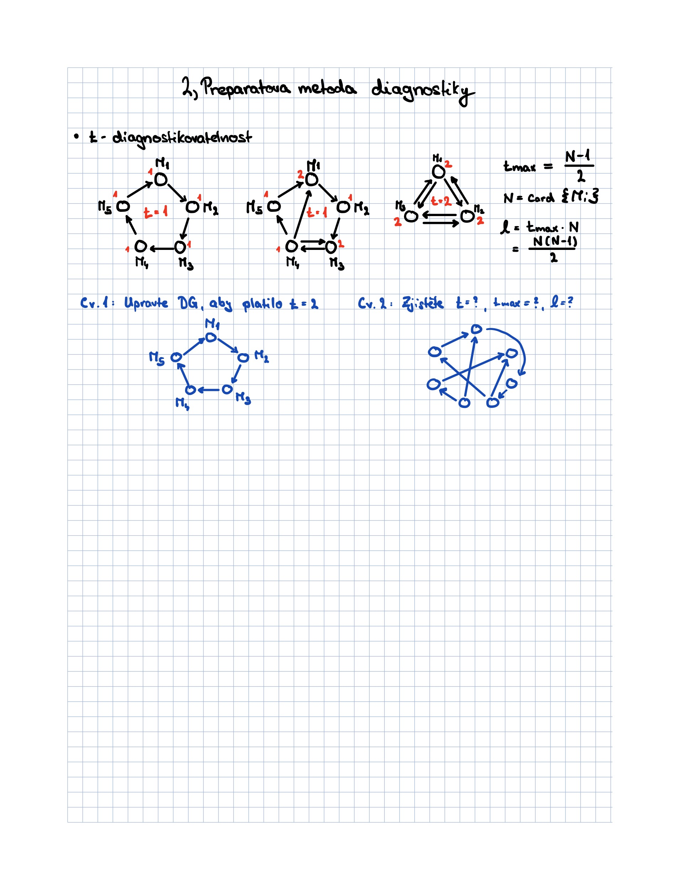

# Dependabilita informačních systémů

## Cvičení 2 - Preparatova metoda hodnocení diagnostického grafu

V tomto cvičení se podíváme na nejjednodušší metodu, jak hodnot diagnostickou sílu diagnostických grafů.

