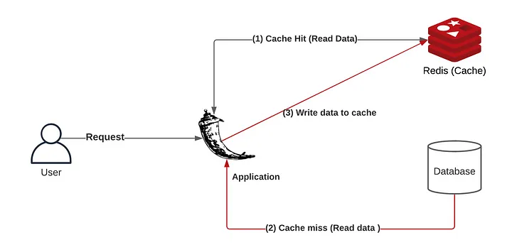

# NoSQL databázové systémy

## Cvičení 5 - Databáze REDIS

V tomto cvičení si vyzkoušíte první samostatnou práci na databázi Redis. Cílem je použít Redis jako vyrovnávací (cache) databázi pro relační databázi. Jedním z nejdůležitějších využití Redisu je její role jako vyrovnávací databáze. Pokud klient zažádá server o nějaká data, tak je možné urychlit jejich návrat tím, že se server podívá nejprve do své volatilní paměti do databázového skladu, který je realizován Redisem. Pokud je tam informace nalezena, tak ji vrátíme. Pokud není, tak se podíváme do datového skladu na pevném disku (naše hlavní databáze). Data z hlavní databáze si následně do Redis uložíme s nějakou dobu žití (time to live) po které budou data smazána. Návrat z volatilní operační paměti je daleko rychlejší než návrat z datového skladu na pevném disku. Pokud je informace nalezena ve vyrovnávací databázi, tak této situaci říkáme cache hit. V opačném případě situaci nazýváme cache miss. Tento koncept má širší využití - lze cachovat naprosto cokoliv a nemusí to nutně být jen data relační databáze.



### Zadání

Doporučeným zdrojem pro dnešní cvičení je následující tutoriál. Vyberte si z něj podstatné fragmenty a implementujte je do mnou dodané kódové báze nebo vaší vlastní (té, které rozumíte). [ZDE](https://levelup.gitconnected.com/implement-api-caching-with-redis-flask-and-docker-step-by-step-9139636cef24)

1. Vyberte si nějakou relační databázi a vytvořte alespoň jednu tabulku, kterou naplňte daty. 
2. Uložte si databázi do adresáře s projektem.
3. Vytvořte formulář, kterým se uživatel může zeptat na nějaká data z relační databáze.
4. Zpracujte jeho požadavek z formuláře do SQL dotazu.
5. Zobrazte na vybrané stránce výsledek dotazu nad databází a zkontrolujte funkčnost.
6. Přidejte před vaší databázi Redis jako vyrovnávací databázi a vyzkoušejte, že funguje cache hit a cache miss.
7. Porovnejte urychlení žádostí o data pomocí poměru cache hit a cache miss.

**Komentář k úkolu 1**
Osobně z důvodu jednoduchosti doporučuji SQLite3. Pokud si vyberete SQLite3, tak mnou doporučený postup je takový, že si nejprve stáhnete Sqlite-tools [ZDE](https://www.sqlite.org/download.html), rozbalíte si archiv a spustíte. V archivu spustíte sqlite3.exe (nebo jiný binární formát podle operačního systému) a vytvoříte tabulku (při spuštění možná vyskočí bezpečnostní hláška, tak ji přesto spusťte). Následně vytvoříme nějakou tabulku:
```
CREATE TABLE ovce (
	id INTEGER PRIMARY KEY,
	druh TEXT NOT NULL,
	hmotnost TEXT NOT NULL,
    vlna TEXT NOT NULL,
	popis TEXT NOT NULL
);
```

Pomocí příkazu ```.tables``` si můžeme ověřit, že tabulka existuje. Následně ji naplníme daty.

```
INSERT INTO ovce (druh, hmotnost, vlna, popis)
VALUES 
('Merino', 62, 5.2,'Plemeno je středního až většího tělesného rámce s kombinovanou vlnařsko-masnou užitkovostí.. Hlava přiměřeně dlouhá, klínovitého vzezření s mírným obrůstem vlnou na obličejové části hlavy, temeni a čele. Vlna bílá, sortiment AB-B (23-27 mm), rouno uzavřené. Středně dlouhý krk přechází harmonicky v široké, pevné a dobře navázané plece. Hřbet rovný, široký a dlouhý. Hrudník prostorný s dobře klenutými žebry. Křížová část těla dosti široká, která přechází v mírně skloněnou záď. Končetiny silné s pevnými spěnkovými klouby. Pohlavní znaky, zejména u beranů, výrazné. Kůže po celém těle narůžovělá, nepigmentovaná.'),

('Šumavská',60 ,3.7, 'Plemeno s trojstrannou užitkovostí, které pochází z českých selských ovcí a svým původem a typem připomíná zušlechtěnou valašku. Od 50. let minulého století bylo postupně regenerováno fylogeneticky příbuznými plemeny (württemberská ovce, texel, sovětská cigája, lincoln, kent, leicester, zušlechtěná valaška). Vyznačuje se středně velkým tělesným rámcem, průměrným osvalením a růstovou schopností.'),

('Německá dlouhovlnná', 65, 5.2, 'Plemeno vyšlechtěno v bývalé NDR. Je středního až většího tělesného rámce. Kombinovaného až masného užitkového typu. Ovce jsou většího tělesného rámce a harmonické stavby těla.Vlna bílá, rouno polouzavřené, obrůst hlavy a nohou malý.'),

('Kamerunská',32, 0, 'Srstnaté západoafrické zakrslé plemeno, vyskytující se ve dvou základních užitkových barevných typech: hnědé srnčí a černobílé. Berani jsou rohatí s charakteristickou hřívou, bahnice bezrohé. Ovce jsou odolné proti tripanosomě. Plemeno se podílelo v Americe na vzniku ovce nungua černohlavé a vogan. Hnědé plemeno s černou barvou břicha a vnitřní částí končetin je menšího tělesného rámce a pevné konstituce. Hlava středně dlouhá, u beranů mírně klabonosá. Krk svalnatý a poměrně dlouhý. Hruď středně hluboká a široká. Končetiny středně dlouhé, pevné. Hřbet rovný, záď mírně sražená. Srst vyrovnaná a lesklá.'),

('Vřesová', 43, 2.3, 'Hrubovlnné, kožichové, krátkoocasé skromné plemeno, které pochází ze severovýchodního Německa. Svůj původ odvozuje od muflona. Po staletí je chováno na chudých, písčitých půdách vřesovišť. Pozdní plemeno menšího tělesného rámce. Obě pohlaví jsou rohatá, u beranů se rohy šnekovitě vinou do strany. Uši malé, šikmo postavené. Krk vysoko nasazený, hruď hluboká a klenutá.'),

('Valaška', 37, 1.7 , 'Původní hrubovlnné plemeno s trojstrannou užitkovostí (mléko, maso, vlna) přizpůsobené k salašnickému způsobu chovu. Patří do skupiny cápových ovcí chovaných na Balkáně. Do našich oblastí rozšířeno s valašskou kolonizací ve 14. stol. Je menšího tělesného rámce, hlava klínovitá, v čele úzká, u beranů mírně klabonosá. Uši poměrně krátké, rohatost u obou pohlaví častá, rohy jsou šroubovité, lyrovitého nebo přímého tvaru. Krk delší, hruď úzká a mírně klenutá, hřbet rovný a úzký, záď mírně sražená, pánev poměrně široká. Končetiny kratší, rovné s pevnou spěnkou. Vlna smíšená, hrubá a splývavého charakteru.'),
    
('Jurská', 65, 3.2, 'Plemeno vyšlechtěné ve Švýcarsku z místní černohnědé ovce za přispění plemene walliser a roux de bagnes. Svůj název plemeno dostalo v Rakousku. Je středního tělesného rámce a na nižší noze. Plemeno je temperamentní, bezrohé s rovnou obličejovou části. Uši středně dlouhé, poloklopené. Chovají se dva barevné typy: tmavohnědý a světlehnědý. Hlava je porostlá jemnou lesklou srstí, končetiny holé bez obrůstu.');
```

Ověření toho, že se povedlo do databáze zapsat můžeme provést příkazem ```SELECT * FROM ovce;``

Následně databázi uložíme na pevný disk pomocí příkazu: ```.save ovce.db``` případně si sami vyberte název.

**Komentář k úkolu 2**
Jelikož SQLite3 se pro webové aplikace příliš nepoužívá, tak neexistuje univerzální rada, kam databázový soubor umístit. Jediné doporučení, které jsem našel, je vedle vaší spouštění aplikace, tedy app.py.

**Komentář k úkolu 3**
Můžete využít již hotový formulář z mého projektu (i bez WTFlask). Příklad takového formuláře pro mou aplikace může být (verze s WTForms):
```
from flask_wtf import FlaskForm
from flask_wtf.file import FileField, FileRequired
from wtforms import StringField, TextAreaField, SubmitField, FileField
from wtforms import validators


class ContactForm(FlaskForm):
   username = StringField("User Name:",[validators.DataRequired("Please enter your name.")])
   review = TextAreaField("Review: ", [validators.DataRequired("Please enter website review.")])
   image = FileField(validators=[FileRequired()])
   submit = SubmitField("Send")

class SheepForm(FlaskForm):
   sheepname = StringField("Sheep Name:",[validators.DataRequired("Please enter sheep name.")])
   submit = SubmitField("Send")
```
nebo bez WTForms:

```



Datasets



<h2>Sheep dataset</h2>
<form action="datasets" method="post">
    <fieldset>
        <label for="sheepname">Sheep name: </label>
        <input type="text" name="sheep" required>
    </fieldset>
    <button type="submit">Show sheep info</button>
</form>


```

**Komentář k úkolu 4**
Nejprve budete muset získat data pomocí SQL dotazu z databáze. Návod na to naleznete například [ZDE](https://pythonbasics.org/flask-sqlite/) nebo mnoho dotazů na stackoverflow.

**Komentář k úkolu 5**
Data mohu zobrazit na stránku pomocí Jinja2 šablonovacího jazyku (například u mě na stejnou stránku jako je formulář s dotazem). První prvek ze záznamu databáze je vynechán, jelikož se jedná o id druhu ovce.

```



Datasets



<h2>Sheep dataset</h2>
<form action="datasets" method="post">
    <fieldset>
        <label for="sheepname">Sheep name: </label>
        <input type="text" name="sheep" required>
    </fieldset>
    <button type="submit">Show sheep info</button>
</form>

<ul>
    
    <li>Name: {{ sheep[1] }}</li>
    <li>Weight [kg]: {{ sheep[2] }}</li>
    <li>Produced wool [kg]: {{ sheep[3] }}</li>
    <li>Description: {{ sheep[4] }}</li>
    
</ul>


```

**Komentář k úkolu 6**
Redis dodáte do aplikace podle zmíněného hlavního tutoriálu k dnešnímu cvičení. Nezapomeňte správně nastavit připojení do Redisu podle vašeho docker-compose.yml souboru. Tutoriál na Redis naleznete [ZDE](https://levelup.gitconnected.com/implement-api-caching-with-redis-flask-and-docker-step-by-step-9139636cef24)

**Komentář k úkolu 7**
Měření doby trvání operace při cache hit a cache miss můžete provést pomocí nějaké knihovny pro měření doby délek funkcí. Jedna z nejpoužívanějších je timeit. Tutorial naleznete [ZDE](https://www.einblick.ai/python-code-examples/python-timeit/)

## Materiály k samostudiu

Pokud vás tematika zaujala, tak více se můžeme dozvědět o Redis a jeho využívání v ekosystému python technologií na tutoriálech [ZDE](https://realpython.com/search?q=redis).
Pro lepší procvičení Redisu vám doporučuji minimálně tento tutoriál: [ZDE](https://realpython.com/python-redis/). Pokud se chcete lépe připravit na příští lekci, tak budeme využívat Redis pro frontu. Úloha bude podobná této: [ZDE](https://realpython.com/flask-by-example-implementing-a-redis-task-queue/).


