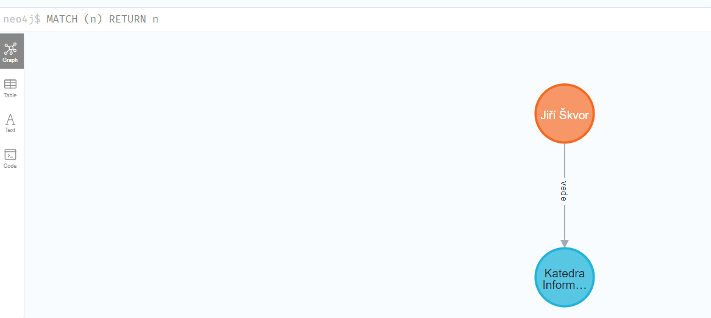
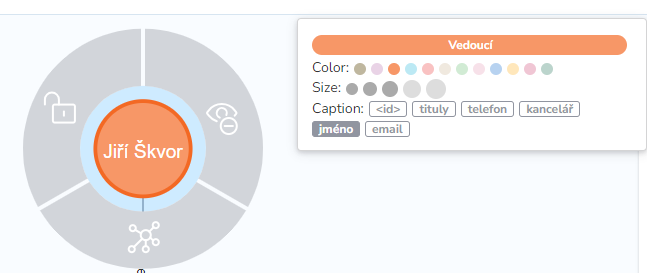
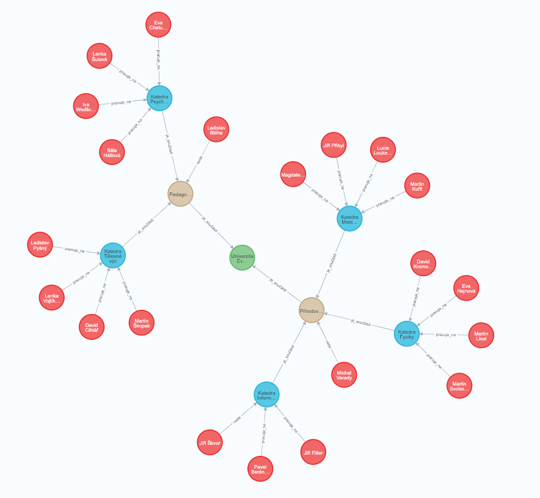
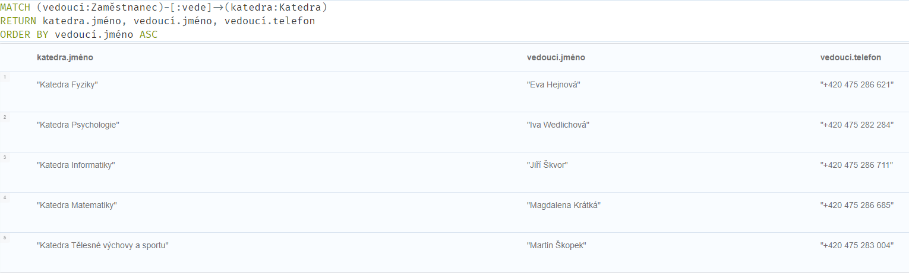
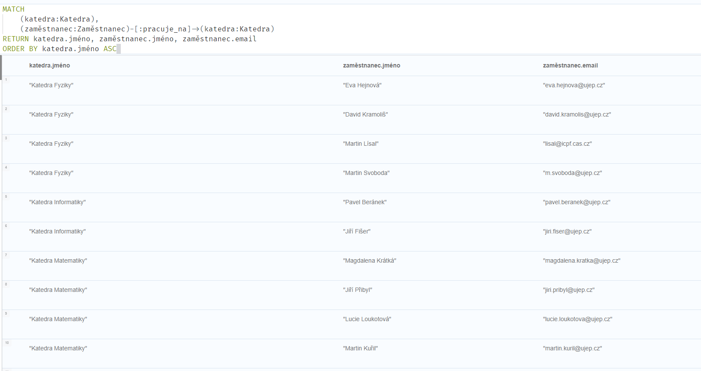

# NoSQL databázové systémy

## Cvičení 10 - Grafová databáze Neo4J

### Zadání
V tomto cvičení si budeme hrát s grafovou databází Neo4J bez kódu v jazyce Python. Vyzkoušíme si pomocí jazyka Cypher budovat grafovou databázi ve webové prohlížeči. Cílem bude vytvořit graf, reprezentující vztahy mezi univerzitou, fakultami, katedrami a zaměstnanci UJEP. Následně si vyzkoušíte i jednoduché dotazy.

#### Úkoly
Pokud se chcete naučit Neo4j řádně, tak můžete úkoly s využitím generativní jazykové AI nebo návodů na internetu řešit bez pomoci. Pokud byste s konkrétním úkolem příliš bojovali, tak se můžete podívat do mého řešení.

1. Napište si docker-compose.yml soubor, který stáhne neo4j obraz, nastaví porty na databázi a protokol pro komunikaci bolt a nastaví přístupové údaje.
2. Otevřete si Neo4j databázi v prohlížeči a přihlašte se do systému (db nemusíte volit a nechat prázdné).
3. Vytvořte uzel v databázi pomocí Cypher jazyka. Uzel se bude jmenovat Katedra a jeho vlastnosti budou adresa a patro. Vyplňte do adresy adresu budovy CPTO a do patra číslo 6.
4. Vytvořte druhý uzel v databázi pomocí Cypher Jazyka. Uzel se bude jmenovat Vedoucí a jeho vlastnosti budou jméno, tituly, kancelář, telefon a email. Vyplňte informace podle následujícího odkazu [ZDE](https://ki.ujep.cz/cs/personalni-slozeni/jiri-skvor/).
5. Vytvořte vztah mezi těmito uzly. Vztah bude mít název: vede katedru.
6. Prohlédněte si ve webové vizualizaci vytvořenou grafovou databázi. Nastavte si popisky uzlů ať se vám graf lépe chápe.
7. Doplňte zaměstnance a dej jim řádné vztahy ke katedře (stačí pár příkladů).
8. Rozšiřte příklad o fakultu a katedry (stačí pár příkladů).
9. Rozšiřte příklad o univerzitu a fakulty (stačí pár příkladů).
10. Vytvořte Cypher dotaz, který vypíše názvy všech fakult.
11. Vytvořte Cypher dotaz, který vypíše názvy všech kateder na všech fakultách.
12. Vytvořte Cypher dotaz, který vypíše všechny telefony vedoucích kateder.
13. Vytvořte Cypher dotaz, který vypíše všechny emaily zaměstnanců kateder přírodovědecké fakulty.

Pokud byste potřebovali smazat vytvořené uzly a vztahy mezi nimi, tak to můžete provést následujícím příkazem, který smaže všechny uzly s nějakým vztahem:
```
match (uzel) -[vztah] -> () delete uzel, vztah
```
 a následně osamocené uzly smažete:
```
match (uzel) delete uzel
```


**Řešení úkolu 1**
```
version: '3'

services:
  neo4j:
    image: 'neo4j:latest'
    ports:
      - '7474:7474'
      - '7687:7687'
    environment:
      NEO4J_AUTH: 'neo4j/adminpass'
```

Následně pomocí příkazu ```docker-compose up``` v terminálu spustím.

**Řešení úkolu 2**

Stačí otevřít v prohlížeči adresu localhost s portem podle docker-compose.yml souboru. Implicitně je to port 7474. Pak zadáte svoje údaje z docker-compose souboru a prihlásíte se. Jméno databáze zvolte například test.

**Řešení úkolu 3**

V prohlížeči nalezneme horní příkazovou lištu a zadáme tam příkaz pro vytvoření uzlu:
```
CREATE(katedra:Katedra{jméno: "Katedra Informatiky", adresa: "Pasteurova 3632/15, 400 96 Ústí nad Labem", patro: 6})
```

**Řešení úkolu 4**

```
CREATE(vedoucí: Vedoucí{jméno: "Jiří Škvor", tituly: "RNDr., Ph.D.", kancelář: "6.01", telefon: "+420 475 286 711", email:"jiri.skvor@ujep.cz"})
```

**Řešení úkolu 5**
Najdeme vedoucího katedry a katedru pomocí MATCH příkazu a příkazem CREATE vytvoříme mezi nimi vztah.
```
MATCH
  (vedoucí: Vedoucí),
  (katedra: Katedra)
CREATE (vedoucí)-[: vede]->(katedra)
```

**Řešení úkolu 6**

Vizualizaci grafu provedu následujícím příkazem:
```
MATCH (uzel) RETURN uzel
```



Když kliknu na uzel, tak po pravé straně bude barevně značka nad vlastnostmi uzlu. Když na ní kliknu, tak se mi zobrazí k dispozici sada vizualizačních vlastností (barva, velikost, popisek). Vyberte si vhodnou vizualizaci a hlavně správné popisky.


**Řešení úkolu 7**

Zde bych doporučoval předělat původní strukturu tříd. Udělal bych z vedoucího katedry také zaměstnance, ale jeho vztah ke katedře je vede. Ostatní budou také zaměstnanci, ale budou jen pracovat na katedře. Vztah bude nahrazovat rozdílnou třídu.

Změna třídy (značky, angl. label) pro vedoucího (id zjistíte při kliku na uzel):
```
MATCH (uzel)
WHERE ID(uzel) = 1
REMOVE uzel:Vedoucí
SET uzel:Zaměstnanec
```

Vytvoření zaměstnanců:
```
CREATE(zaměstnanec1: Zaměstnanec{jméno: "Jiří Fišer", tituly: "Mgr., Ph.D.", kancelář: "6.03", telefon: "+420 475 286 715", email:"jiri.fiser@ujep.cz"})

CREATE(zaměstnanec2: Zaměstnanec{jméno: "Pavel Beránek", tituly: "Ing., Mgr.", kancelář: "6.07", telefon: "+420 475 286 724", email:"pavel.beranek@ujep.cz"})
```

Teď doplníme vztahy uzlů ke katedře. Jiřímu Škvorovi můžeme dát také vztah pracuje (bude mít dva vztahy) nebo ho ze vztahu vyloučíme a bude mít pouze vztah vede. Zde ho vylučuji ze vztahu.:
```
MATCH
  (zaměstnanec: Zaměstnanec WHERE zaměstnanec.jméno <> "Jiří Škvor"),
  (katedra: Katedra)
CREATE (zaměstnanec)-[: pracuje_na]->(katedra)
```

**Řešení úkolu 8**
Vytvoříme dvě fakulty - Přírodovědeckou fakultu a Pedagogickou fakultu. K přírodovědecké fakultě bude mít vztah Katedra Informatiky a dále vytvoříme uzly a vztahy pro katedru fyziky a matematiky. Následně vytvoříme ještě Katedra psychologie a Katedra tělesné výchovy a sportu k Pedagogické fakultě. Můžeme rovnou vytvořit i děkany.

Vytvoření Přírodovědecké fakulty s děkanem:
```
CREATE(fakulta: Fakulta{jméno: "Přírodovědecká fakulta"})
CREATE(děkan: Zaměstnanec{jméno: "Michal Varady", tituly: "doc., RNDr., Ph.D.", kancelář: "8.18a", telefon: "+420 475 286 667", email:"dekan.prf@ujep.cz"})
```

Přidání vztahu mezi děkanem a fakultou:
```
MATCH
  (děkan: Zaměstnanec WHERE děkan.jméno = "Michal Varady"),
  (fakulta: Fakulta WHERE fakulta.jméno = "Přírodovědecká fakulta")
CREATE (děkan)-[: vede]->(fakulta)
```

Vytvoření kateder přírodovědecké fakulty:
```
CREATE(katedra1:Katedra{jméno: "Katedra Fyziky", adresa: "Pasteurova 3632/15, 400 96 Ústí nad Labem", patro: 2})
CREATE(katedra2:Katedra{jméno: "Katedra Matematiky", adresa: "Pasteurova 3632/15, 400 96 Ústí nad Labem", patro: 7})
```

Přidání vztahu mezi katedrami a fakultou:
```
MATCH
  (katedra: Katedra),
  (fakulta: Fakulta WHERE fakulta.jméno = "Přírodovědecká fakulta")
CREATE (katedra)-[: je_součástí]->(fakulta)
```

Vytvoření zaměstnanců katedry fyziky:
```
CREATE(zaměstnanec1: Zaměstnanec{jméno: "Martin Svoboda", tituly: "Mgr., Ph.D.", kancelář: "2.16", telefon: "+420 475 286 639", email:"m.svoboda@ujep.cz"})
CREATE(zaměstnanec2: Zaměstnanec{jméno: "Martin Lísal", tituly: "prof.,Ing.,DSc.", kancelář: "2.16", telefon: "+420 475 286 638", email:"lisal@icpf.cas.cz"})
CREATE(zaměstnanec3: Zaměstnanec{jméno: "David Kramoliš", tituly: "Mgr., Ph.D.", kancelář: "3.15", telefon: "+420 606 857 877", email:"david.kramolis@ujep.cz"})
CREATE(vedoucí: Zaměstnanec{jméno: "Eva Hejnová", tituly: "PhDr., Ph.D.", kancelář: "2.01", telefon: "+420 475 286 621", email:"eva.hejnova@ujep.cz"})
```

Přidání vztahů mezi zaměstnaneci a katedrou fyziky:
```
MATCH
  (zaměstnanec: Zaměstnanec WHERE zaměstnanec.jméno = "Martin Svoboda"),
  (katedra: Katedra WHERE katedra.jméno = "Katedra Fyziky")
CREATE (zaměstnanec)-[: pracuje_na]->(katedra)
```
```
MATCH
  (zaměstnanec: Zaměstnanec WHERE zaměstnanec.jméno = "Martin Lísal"),
  (katedra: Katedra WHERE katedra.jméno = "Katedra Fyziky")
CREATE (zaměstnanec)-[: pracuje_na]->(katedra)
```
```
MATCH
  (zaměstnanec: Zaměstnanec WHERE zaměstnanec.jméno = "David Kramoliš"),
  (katedra: Katedra WHERE katedra.jméno = "Katedra Fyziky")
CREATE (zaměstnanec)-[: pracuje_na]->(katedra)
```
```
MATCH
  (zaměstnanec: Zaměstnanec WHERE zaměstnanec.jméno = "Eva Hejnová"),
  (katedra: Katedra WHERE katedra.jméno = "Katedra Fyziky")
CREATE (zaměstnanec)-[: vede]->(katedra)
```

Vytvoření zaměstnanců katedry matematiky:
```
CREATE(zaměstnanec1: Zaměstnanec{jméno: "Martin Kuřil", tituly: "RNDr., Ph.D.", kancelář: "7.03", telefon: "+420 475 286 680", email:"martin.kuril@ujep.cz"})
CREATE(zaměstnanec2: Zaměstnanec{jméno: "Lucie Loukotová", tituly: "Mgr.", kancelář: "7.16", telefon: "+420 475 286 688", email:"lucie.loukotova@ujep.cz"})
CREATE(zaměstnanec3: Zaměstnanec{jméno: "Jiří Přibyl", tituly: "PhDr., Ph.D.", kancelář: "7.11", telefon: "+420 475 286 682", email:"jiri.pribyl@ujep.cz"})
CREATE(vedoucí: Zaměstnanec{jméno: "Magdalena Krátká", tituly: "PhDr., Ph.D.", kancelář: "7.15", telefon: "+420 475 286 685", email:"magdalena.kratka@ujep.cz"})
```

Přidání vztahů mezi zaměstnaneci a katedrou matematiky:
```
MATCH
  (zaměstnanec: Zaměstnanec WHERE zaměstnanec.jméno = "Martin Kuřil"),
  (katedra: Katedra WHERE katedra.jméno = "Katedra Matematiky")
CREATE (zaměstnanec)-[: pracuje_na]->(katedra)
```
```
MATCH
  (zaměstnanec: Zaměstnanec WHERE zaměstnanec.jméno = "Lucie Loukotová"),
  (katedra: Katedra WHERE katedra.jméno = "Katedra Matematiky")
CREATE (zaměstnanec)-[: pracuje_na]->(katedra)
```
```
MATCH
  (zaměstnanec: Zaměstnanec WHERE zaměstnanec.jméno = "Jiří Přibyl"),
  (katedra: Katedra WHERE katedra.jméno = "Katedra Matematiky")
CREATE (zaměstnanec)-[: pracuje_na]->(katedra)
```
```
MATCH
  (zaměstnanec: Zaměstnanec WHERE zaměstnanec.jméno = "Magdalena Krátká"),
  (katedra: Katedra WHERE katedra.jméno = "Katedra Matematiky")
CREATE (zaměstnanec)-[: vede]->(katedra)
```

Vytvoření Pedagogické fakulty s děkanem:
```
CREATE(fakulta: Fakulta{jméno: "Pedagogická fakulta"})
CREATE(děkan: Zaměstnanec{jméno: "Ladislav Bláha", tituly: "doc., PaedDr., Ph.D.", kancelář: "CS-212", telefon: "+420 475 283 124", email:"ladislav.blaha@ujep.cz"})
```

Přidání vztahu mezi děkanem a fakultou:
```
MATCH
  (děkan: Zaměstnanec WHERE děkan.jméno = "Ladislav Bláha"),
  (fakulta: Fakulta WHERE fakulta.jméno = "Pedagogická fakulta")
CREATE (děkan)-[: vede]->(fakulta)
```

Vytvoření kateder Pedagogické fakulty:
```
CREATE(katedra1:Katedra{jméno: "Katedra Psychologie", adresa: " Hoření 13, 400 96 Ústí nad Labem", patro: 1})
CREATE(katedra2:Katedra{jméno: "Katedra Tělesné výchovy a sportu", adresa: "České mládeže 8, 400 96 Ústí nad Labem-město", patro: 2})
```

Přidání vztahu mezi katedrami a fakultou:
```
MATCH
  (katedra: Katedra WHERE katedra.jméno = "Katedra Psychologie"),
  (fakulta: Fakulta WHERE fakulta.jméno = "Pedagogická fakulta")
CREATE (katedra)-[: je_součástí]->(fakulta)
```
```
MATCH
  (katedra: Katedra WHERE katedra.jméno = "Katedra Tělesné výchovy a sportu"),
  (fakulta: Fakulta WHERE fakulta.jméno = "Pedagogická fakulta")
CREATE (katedra)-[: je_součástí]->(fakulta)
```

Vytvoření zaměstnanců katedry psychologie:
```
CREATE(zaměstnanec1: Zaměstnanec{jméno: "Eva Chalupová", tituly: "PhDr., Ph.D.", kancelář: "134", telefon: "+420 475 282 287", email:"eva.chalupova@ujep.cz"})
CREATE(zaměstnanec2: Zaměstnanec{jméno: "Běla Hátlová", tituly: "doc.,Ph.D.", kancelář: "134", telefon: "+420 475 282 287", email:"bela.hatlova@ujep.cz"})
CREATE(zaměstnanec3: Zaměstnanec{jméno: "Lenka Šulová", tituly: "prof., PhDr., CSc.", kancelář: "134", telefon: "Není", email:"lenka.sulova@ujep.cz"})
CREATE(vedoucí: Zaměstnanec{jméno: "Iva Wedlichová", tituly: "PhDr., Ph.D.", kancelář: "136", telefon: "+420 475 282 284", email:"iva.wedlichova@ujep.cz"})
```

Přidání vztahů mezi zaměstnanci a katedrou psychologie:
```
MATCH
  (zaměstnanec: Zaměstnanec WHERE zaměstnanec.jméno = "Eva Chalupová"),
  (katedra: Katedra WHERE katedra.jméno = "Katedra Psychologie")
CREATE (zaměstnanec)-[: pracuje_na]->(katedra)
```
```
MATCH
  (zaměstnanec: Zaměstnanec WHERE zaměstnanec.jméno = "Běla Hátlová"),
  (katedra: Katedra WHERE katedra.jméno = "Katedra Psychologie")
CREATE (zaměstnanec)-[: pracuje_na]->(katedra)
```
```
MATCH
  (zaměstnanec: Zaměstnanec WHERE zaměstnanec.jméno = "Lenka Šulová"),
  (katedra: Katedra WHERE katedra.jméno = "Katedra Psychologie")
CREATE (zaměstnanec)-[: pracuje_na]->(katedra)
```
```
MATCH
  (zaměstnanec: Zaměstnanec WHERE zaměstnanec.jméno = "Iva Wedlichová"),
  (katedra: Katedra WHERE katedra.jméno = "Katedra Psychologie")
CREATE (zaměstnanec)-[: vede]->(katedra)
```

Vytvoření zaměstnanců katedry tělesné výchovy a sportu:
```
CREATE(zaměstnanec1: Zaměstnanec{jméno: "David Cihlář", tituly: "Mgr., Ph.D.", kancelář: "SH 219", telefon: "+420 475 283 217", email:"david.cihlar@ujep.cz"})
CREATE(zaměstnanec2: Zaměstnanec{jméno: "Ladislav Pyšný", tituly: "prof.,MUDr.,CSc.,MPH", kancelář: "SH 216", telefon: "+420 475 283 230", email:"ladislav.pysny@ujep.cz"})
CREATE(zaměstnanec3: Zaměstnanec{jméno: "Lenka Vojtíková", tituly: "Mgr. Ph.D.", kancelář: "SH 215", telefon: "+420 475 283 230", email:"lenka.vojtikova@ujep.cz"})
CREATE(vedoucí: Zaměstnanec{jméno: "Martin Škopek", tituly: "PhDr., Ph.D.", kancelář: "SH 201", telefon: "+420 475 283 004", email:"martin.skopek@ujep.cz"})
```

Přidání vztahů mezi zaměstnanci a katedrou tělesné výchovy a sportu:
```
MATCH
  (zaměstnanec: Zaměstnanec WHERE zaměstnanec.jméno = "David Cihlář"),
  (katedra: Katedra WHERE katedra.jméno = "Katedra Tělesné výchovy a sportu")
CREATE (zaměstnanec)-[: pracuje_na]->(katedra)
```
```
MATCH
  (zaměstnanec: Zaměstnanec WHERE zaměstnanec.jméno = "Ladislav Pyšný"),
  (katedra: Katedra WHERE katedra.jméno = "Katedra Tělesné výchovy a sportu")
CREATE (zaměstnanec)-[: pracuje_na]->(katedra)
```
```
MATCH
  (zaměstnanec: Zaměstnanec WHERE zaměstnanec.jméno = "Lenka Vojtíková"),
  (katedra: Katedra WHERE katedra.jméno = "Katedra Tělesné výchovy a sportu")
CREATE (zaměstnanec)-[: pracuje_na]->(katedra)
```
```
MATCH
  (zaměstnanec: Zaměstnanec WHERE zaměstnanec.jméno = "Martin Škopek"),
  (katedra: Katedra WHERE katedra.jméno = "Katedra Tělesné výchovy a sportu")
CREATE (zaměstnanec)-[: vede]->(katedra)
```

**Řešení úkolu 9**
Pojďme rozšířit graf o univerzitu UJEP a dát fakulty do vztahu s ní:
```
CREATE(univerzita: Univerzita{jméno: "Univerzita Jana Evangelisty Purkyně v Ústí nad Labem"})
```
```
MATCH
  (fakulta: Fakulta),
  (univerzita: Univerzita)
CREATE (fakulta)-[: je_součástí]->(univerzita)
```

Výsledek naší náročné práce by měl vypadat takto:


**Řešení úkolu 10**
Cypher dotaz, který vypíše názvy všech fakult, se provede tímto způsobem:
```
MATCH (fakulta:Fakulta)
RETURN fakulta.jméno
ORDER BY fakulta.jméno ASC
```

**Řešení úkolu 11**
Cypher dotaz, který vypíše názvy všech kateder na všech fakultách, se provede tímto způsobem:
```
MATCH (katedra:Katedra)
RETURN katedra.jméno
ORDER BY katedra.jméno ASC
```

**Řešení úkolu 12**
Cypher dotaz, který vypíše všechny telefony vedoucích kateder, se provede tímto způsobem:
```
MATCH (vedoucí:Zaměstnanec)-[:vede]->(katedra:Katedra)
RETURN katedra.jméno, vedoucí.jméno, vedoucí.telefon
ORDER BY vedoucí.jméno ASC
```



**Řešení úkolu 13**
Cypher dotaz, který vypíše všechny emaily zaměstnanců kateder přírodovědecké fakulty, se provede tímto způsobem:
```
MATCH 
    (katedra:Katedra),
    (zaměstnanec:Zaměstnanec)-[:pracuje_na]->(katedra:Katedra)
RETURN katedra.jméno, zaměstnanec.jméno, zaměstnanec.email
ORDER BY katedra.jméno ASC
```
