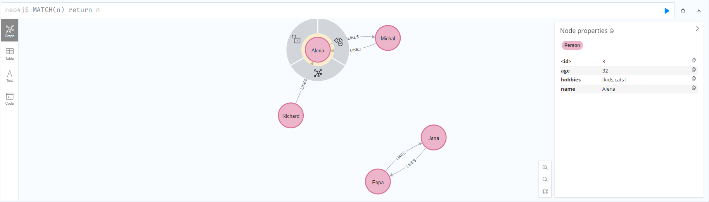

# NoSQL databázové systémy

## Cvičení 11 - Aplikace grafových databází

### Zadání

V tomto cvičení si vytvoříme pomocí Neo4j jednoduchou sociální síť. Cílem je naučit vás pracovat s Neo4j z python kódu.

1. Vytvořte si docker-compose.yml soubor, ve kterém si připravíte flask aplikaci s instalací závislostí. Budeme potřebovat pracovat s modulem py2neo, který podstatně usnadňuje práci s neo4j z Pythonu. V compose souboru bude samozřejmě i příprava neo4j databáze. Důležité upozornění! Neo4j se pouští pomalu a pokud se nějaký obraz k ní připojuje, tak musí počkat nějakou dobu, jinak připojení selže. Řešením je použít healthcheck systém Dockeru, který zkontroluje, zda systém již běží. Ostatní kontejnery se připojí do kontrolovaného kontejneru jen tehdy, je-li již v pořádku.
2. Vytvořte si jednoduchý prototyp online seznamky pomocí py2neo. Vložte do seznamky nějaké uživatele s následujícími parametry: jméno, věk, záliby. Následně vytvořte vztahy mezi nějakými z nich a transakce spusťte. Úspěšné přidání uzlů a vztahů do databáze zkontrolujte pomocí webového prohlížeče.
3. Vytvořte funkci, která nalezne páry uzlů, které si daly vzájemně like. Vypište si je pomocí printu do terminálu. Pokud by vám přišel terminál přiliš nepřehledný kvůli verbositě neo4j, pak si zobrazte pouze log z flask kontejneru pomocí Dockeru.
4. Vytvořte funkci, která nalezne uživatele, který vybraný jedinec ještě neliknul. Nezobrazujte ty uzly, které daly jedincovi dislike. Výsledek si opět vypište pomocí printu.
5. Upravte vyhledávání uživatelů tak, aby se jako první upřednostňovali ty účty, se kterými má náš uživatel vysoký počet společných zálib.
6. Vytvořte kolem funkcionality webový portál ve Flasku. Website bude obsahovat následující stránky: home, search, matches. Při prvotním otevření stránky home vybídne uživatele k přihlášení nebo registraci. Pokud bude přihlášen, pak stránka ukazuje zajímavé (a možná i smutné) informace o uživateli jako je např.: počet lidí k dispozici, se kterými se ještě může matchnout, počet matchů, počet daných liků a pokud jste sadisti tak i počet disliků. Na stránce search se zobrazí účty všech lidí, které ještě může uživatel matchnout a nedali mu dislike. Na stránce matches se zobrazují všechny vzájemné matche. Vytvořte k tomu grafické rozhraní jako ve zjednodušeném Tinderu nebo jiné aplikaci.

### Řešení

**Cvičení 1**

Docker-compose.yml soubor by mohl vypadat následujícím způsobem. Health check je realizován pomocí kontroly toho, zda databáze vrací nějaká data.

```
version: '3'
services:
  flask:
    build: .
    container_name: flask
    ports:
      - "5000:5000"
    volumes:
      - ./code:/code
    depends_on:
      neo4j:
        condition: service_healthy # Wait for neo4j to be ready
      
  neo4j:
    image: 'neo4j:latest'
    ports:
      - '7474:7474'
      - '7687:7687'
    environment:
      NEO4J_AUTH: 'neo4j/adminpass'
    healthcheck:
      test: cypher-shell --username neo4j --password adminpass 'MATCH (n) RETURN COUNT(n);' # Checks if neo4j server is up and running
      interval: 10s
      timeout: 10s
      retries: 5
```

**Cvičení 2**
Jednoduchý prototyp online seznamky by mohl vypadat takto:

```
from py2neo import Graph, Node, Relationship

graph = Graph("bolt://neo4j:7687", auth=("neo4j", "adminpass"))

def main():
    tx = graph.begin()
    pepa = Node("Person", name="Pepa", age=34, hobbies=["programming", "running"])
    jana = Node("Person", name="Jana", age=30, hobbies=["cats", "running"])
    michal = Node("Person", name="Michal", age=38, hobbies=["partying", "cats"])
    alena = Node("Person", name="Alena", age=32, hobbies=["kids", "cats"])
    richard = Node("Person", name="Richard", age=33, hobbies=["partying", "cats"])
    users = [pepa, jana, michal, alena, richard]

    pepovi_se_libi_jana = Relationship(pepa, "LIKES", jana)
    jane_se_libi_pepa = Relationship(jana, "LIKES", pepa)
    michalovi_se_libi_alena = Relationship(michal, "LIKES", alena)
    alene_se_nelibi_michal = Relationship(alena, "DISLIKES", michal)
    richardovi_se_libi_alena = Relationship(richard, "LIKES", alena)
    relationships = [pepovi_se_libi_jana, jane_se_libi_pepa, michalovi_se_libi_alena, alene_se_nelibi_michal, richardovi_se_libi_alena]
    
    for user in users:
        graph.create(user)

    for relationship in relationships:
        graph.create(relationship)

if __name__ == "__main__":
    main()
```


**Cvičení 3**
Funkce, která nalezne páry uzlů, které si daly vzájemně like, by mohla vypadat takto:
```
def print_matches(graph, username):
    for record in graph.run(f"""
                         MATCH (friend:Person)-[:LIKES]->(user:Person)-[:LIKES]->(friend:Person) 
                         WHERE user.name = '{username}'
                         RETURN user.name, friend.name
                         """):
        print(record["friend.name"])
```

Pro výpis logu z flask kontejneru provedeme do nového shellu příkaz:
```
docker-compose logs flask
```

**Cvičení 4**
Funkce, která nalezne uživatele, který vybraný jedinec ještě neliknul a nedali mu dislike, by mohla vypadat takto:
```

```

**Cvičení 5**
```

```

**Cvičení 6**
```

```

**Cvičení 7**
```

```