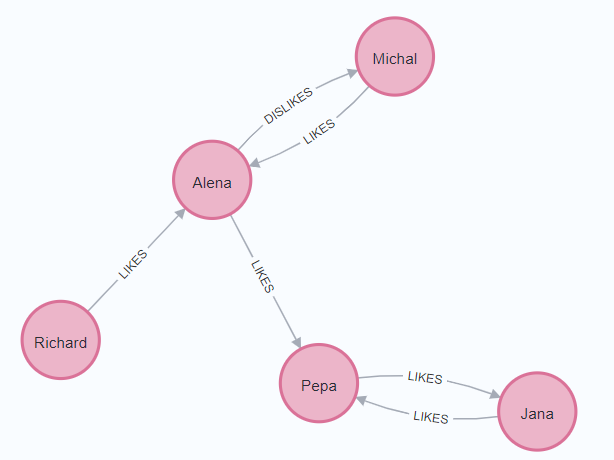
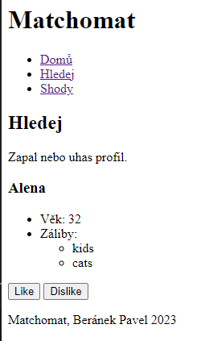
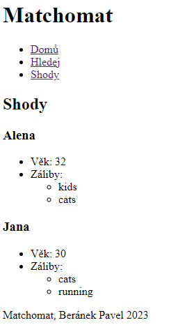

# NoSQL databázové systémy

## Cvičení 11 - Aplikace grafových databází

### Zadání

V tomto cvičení si vytvoříme pomocí Neo4j jednoduchou sociální síť. Cílem je naučit vás pracovat s Neo4j z python kódu.

1. Vytvořte si docker-compose.yml soubor, ve kterém si připravíte flask aplikaci s instalací závislostí. Budeme potřebovat pracovat s modulem py2neo, který podstatně usnadňuje práci s neo4j z Pythonu. V compose souboru bude samozřejmě i příprava neo4j databáze. Důležité upozornění! Neo4j se pouští pomalu a pokud se nějaký obraz k ní připojuje, tak musí počkat nějakou dobu, jinak připojení selže. Řešením je použít healthcheck systém Dockeru, který zkontroluje, zda systém již běží. Ostatní kontejnery se připojí do kontrolovaného kontejneru jen tehdy, je-li již v pořádku.
2. Vytvořte si jednoduchý prototyp online seznamky pomocí py2neo. Vložte do seznamky nějaké uživatele s následujícími parametry: jméno, věk, záliby. Následně vytvořte vztahy mezi nějakými z nich a transakce spusťte. Úspěšné přidání uzlů a vztahů do databáze zkontrolujte pomocí webového prohlížeče.
3. Vytvořte funkci, která nalezne páry uzlů, které si daly vzájemně like. Vypište si je pomocí printu do terminálu. Pokud by vám přišel terminál přiliš nepřehledný kvůli verbositě neo4j, pak si zobrazte pouze log z flask kontejneru pomocí Dockeru.
4. Vytvořte funkci, která nalezne uživatele pro které vybraný jedinec ještě nehlasoval. Nezobrazujte ty uzly, které daly jedincovi dislike. Výsledek si opět vypište pomocí printu.
5. Vytvořte kolem funkcionality webový portál ve Flasku. Website bude obsahovat následující stránky: home, search, matches. Přihlášení můžete nasimulovat jednoduchou konstantou s jménem uživatele, jenž je přihlášen. Úvodní stránka budet ukazovat zajímavé (a možná i smutné) informace o uživateli jako je např.: počet lidí k dispozici, se kterými se ještě může matchnout, počet matchů, počet daných liků a pokud jste sadisti tak i počet disliků. Na stránce search se zobrazí náhodný účet, který ještě může uživatel matchnout a nedali mu dislike. Na stránce matches se zobrazují všechny vzájemné matche. Vytvořte k tomu grafické rozhraní jako ve zjednodušeném Tinderu nebo jiné aplikaci.

### Řešení

**Cvičení 1**

Docker-compose.yml soubor by mohl vypadat následujícím způsobem. Health check je realizován pomocí kontroly toho, zda databáze vrací nějaká data.

```
version: '3'
services:
  flask:
    build: .
    container_name: flask
    ports:
      - "5000:5000"
    volumes:
      - ./code:/code
    depends_on:
      neo4j:
        condition: service_healthy # Wait for neo4j to be ready
      
  neo4j:
    image: 'neo4j:latest'
    ports:
      - '7474:7474'
      - '7687:7687'
    environment:
      NEO4J_AUTH: 'neo4j/adminpass'
    healthcheck:
      test: cypher-shell --username neo4j --password adminpass 'MATCH (n) RETURN COUNT(n);' # Checks if neo4j server is up and running
      interval: 10s
      timeout: 10s
      retries: 5
```

**Cvičení 2**
Jednoduchý prototyp online seznamky by mohl vypadat takto:

```
from py2neo import Graph, Node, Relationship

graph = Graph("bolt://neo4j:7687", auth=("neo4j", "adminpass"))

def main():
    tx = graph.begin()
    pepa = Node("Person", name="Pepa", age=34, hobbies=["programming", "running"])
    jana = Node("Person", name="Jana", age=30, hobbies=["cats", "running"])
    michal = Node("Person", name="Michal", age=38, hobbies=["partying", "cats"])
    alena = Node("Person", name="Alena", age=32, hobbies=["kids", "cats"])
    richard = Node("Person", name="Richard", age=33, hobbies=["partying", "cats"])
    users = [pepa, jana, michal, alena, richard]

    pepovi_se_libi_jana = Relationship(pepa, "LIKES", jana)
    jane_se_libi_pepa = Relationship(jana, "LIKES", pepa)
    michalovi_se_libi_alena = Relationship(michal, "LIKES", alena)
    alene_se_nelibi_michal = Relationship(alena, "DISLIKES", michal)
    richardovi_se_libi_alena = Relationship(richard, "LIKES", alena)
    relationships = [pepovi_se_libi_jana, jane_se_libi_pepa, michalovi_se_libi_alena, alene_se_nelibi_michal, richardovi_se_libi_alena]
    
    for user in users:
        graph.create(user)

    for relationship in relationships:
        graph.create(relationship)

if __name__ == "__main__":
    main()
```


**Cvičení 3**
Funkce, která nalezne páry uzlů, které si daly vzájemně like, by mohla vypadat takto:
```
def get_matches(graph, username):
    return graph.run(f"""
        MATCH (friend:Person)-[:LIKES]->(user:Person)-[:LIKES]->(friend:Person) 
        WHERE user.name = '{username}'
        RETURN friend.name, friend.age, friend.hobbies
    """).data()
```

Návratovou hodnotu můžeme vytisknout do terminálu nebo zobrazit na webové stránce. Jelikož je Neo4j docela verbózní, je lepší vytisknout log z flask kontejneru do shellu příkazem:
```
docker-compose logs flask
```

**Cvičení 4**
Funkce, která nalezne uživatele, pro kterého vybraný jedinec ještě nehlasoval (like ani dislike) a jedinci mu nedali mu dislike, by mohla vypadat takto:
```
def available_matches(graph, username):
    return graph.run(f"""
        MATCH (user:Person)
        MATCH (friend:Person)
        WHERE user.name = '{username}'
        AND NOT (user:Person)-[:LIKES]->(friend:Person)
        AND NOT (friend:Person)-[:DISLIKES]->(user:Person)
        AND NOT (user:Person)-[:DISLIKES]->(friend:Person)
        AND NOT friend.name = '{username}'
        RETURN friend.name, friend.age, friend.hobbies
    """).data()
```

**Cvičení 5**
Statistiky je možné získat již pomocí naprogramovaných funkcí.
```
@app.route("/")
@app.route("/home")
def hello_world():
    logged_user_info = get_logged_user_profile(graph, logged_user)
    num_of_matches = len(get_matches(graph, logged_user))
    num_of_available_matches = len(available_matches(graph, logged_user)) 
    return render_template("home.html", profile=logged_user_info, num_of_matches=num_of_matches, num_of_available_matches=num_of_available_matches)

```
Zde vidíte stránku s profilem uživatele.
```



<h2>Vítej na Matchomatu</h2>
<p>Zapaluj, nech se zapalovat a nalezni si zde svou drahou polovičku se kterou budete hořet.</p>

<h3>Statistiky</h3>
<ul>
  <li>Počet lidí, se kterými se ještě můžeš seznámit: {{ num_of_available_matches }}</li>
  <li>Počet lidí, se kterými jsi již v páru: {{ num_of_matches }}</li>
</ul>

<h3>Tvůj profil</h3>

<article class="card" style="width: 18rem;">
    <!--  -->
    <section class="card-body">
      <h3 class="card-title">{{ profile.get("user.name") }}</h5>
      <ul class="card-text">
        <li>Věk: {{ profile.get("user.age") }}</li>
        <li>Záliby:
            <ul>
            
                <li>{{ hobby }}</li>
            
            </ul>
        </li>
      </ul>
    </section>
</article>

```
Nejsložitější je naprogramovat situaci, která vybere náhodný dostupný uzel a ten můžeme matchnout. Zde bude trošku problém s identifikací účtu, který jsme matchli. Jedna z fint, kterou jsem využil, je využít skrytý HTML vstupní prvek formuláře s hodnotou uzlu pro pozdější identifikaci. 
```



<h2>Hledej</h2>
<p>Zapal nebo uhas profil.</p>

  <article class="card" style="width: 18rem;">
      <!--  -->
      <section class="card-body">
        <h3 class="card-title">{{ profile.get("friend.name") }}</h5>
        <ul class="card-text">
          <li>Věk: {{ profile.get("friend.age") }}</li>
          <li>Záliby:
              <ul>
              
                  <li>{{ hobby }}</li>
              
              </ul>
          </li>
        </ul>
      </section>
  </article>
<form action="/search" method="post">
  <input type="hidden" name="friend_name" value="{{ profile.get('friend.name') }}">
  <button type="submit" class="btn btn-primary" name="date_choice" value="like">Like</button>
  <button type="submit" class="btn btn-primary" name="date_choice" value="dislike">Dislike</button>
</form>

  <p>Žádný profil nenalezen.</p>


```
A samotné zpracování v Pythonu:
```
@app.route("/search", methods=["GET", "POST"])
def search():
    if request.method == "GET":
        potential_matches = available_matches(graph, logged_user)
        if potential_matches:
            random_profile = choice(potential_matches)
        else:
            random_profile = None
        return render_template("search.html", profile=random_profile)
    else:
        date_choice = request.form.get("date_choice")
        friend_name = request.form.get("friend_name")
        user_node = get_user_node(graph, logged_user)
        friend_node = get_user_node(graph, friend_name)
        if date_choice == "like":
            new_relationship = Relationship(user_node, "LIKES", friend_node)
        elif date_choice == "dislike":
            new_relationship = Relationship(user_node, "DISLIKES", friend_node)
        graph.create(new_relationship)
        return redirect("/search")
```

Před matchem vypadá situace takto:


Vidíme, že Pepa má vzájemný like s Janou, takže by ji měl vidět v Matches. Dále vidíme, že mu dala like Alena. Pokud tedy dáme like Aleně, měli bychom ji v matches vidět.



Zbytek kódu naleznete v adresáři kody.