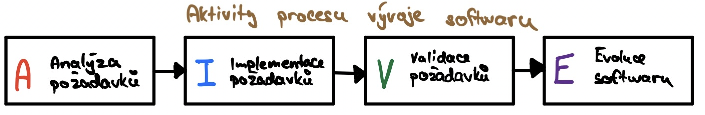
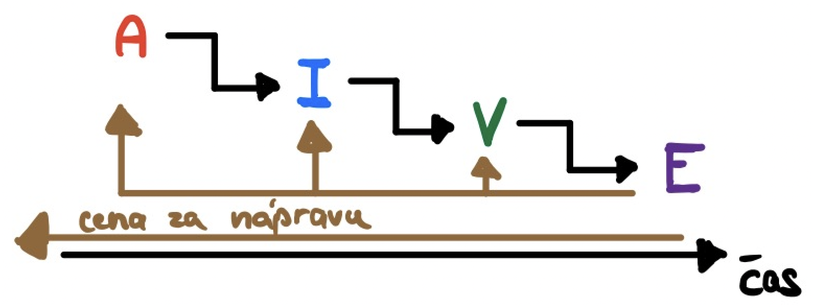
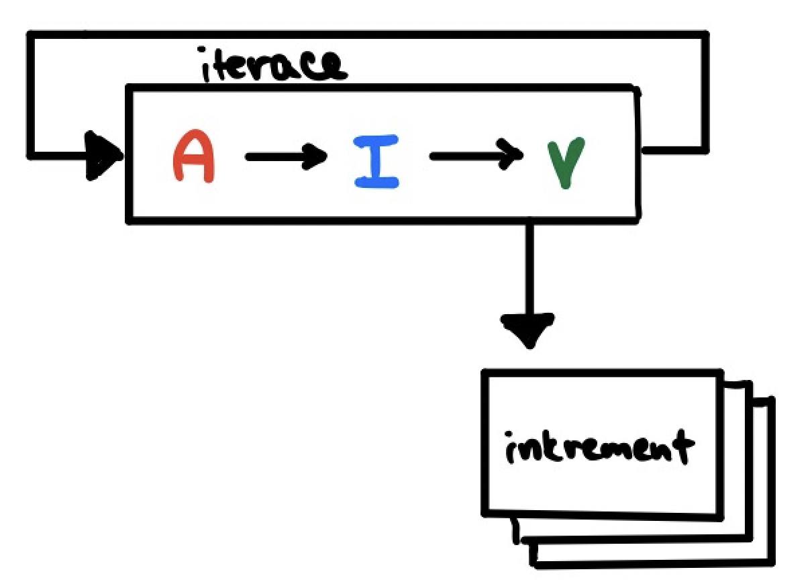
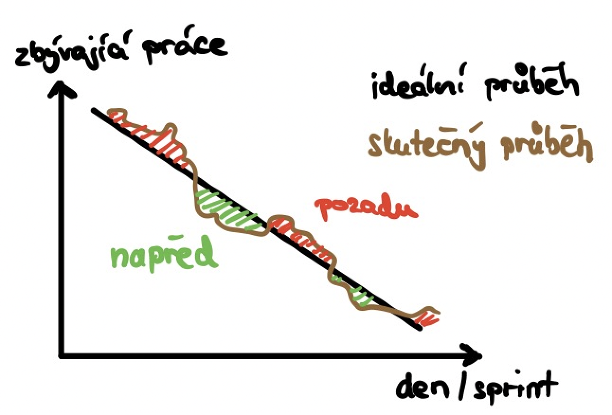
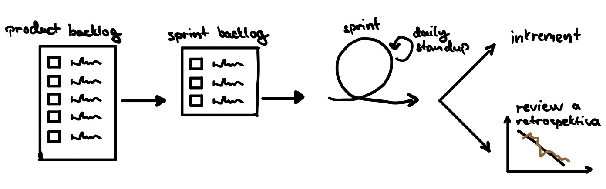
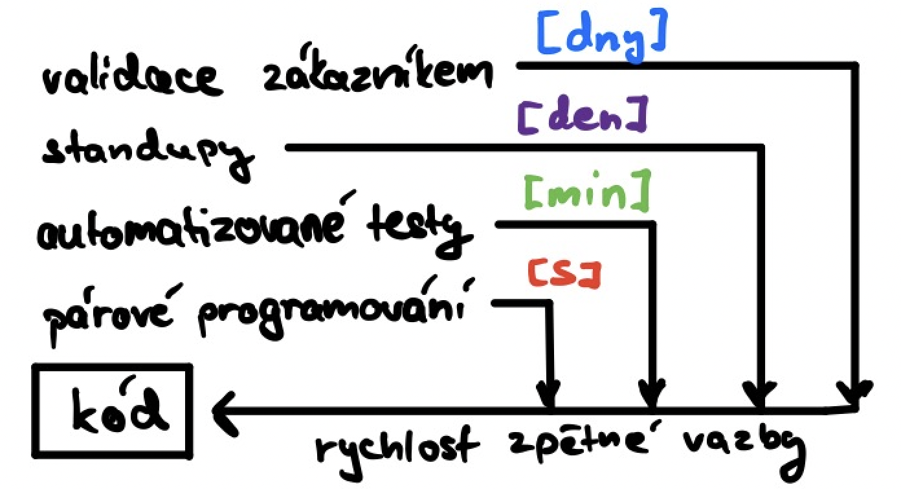
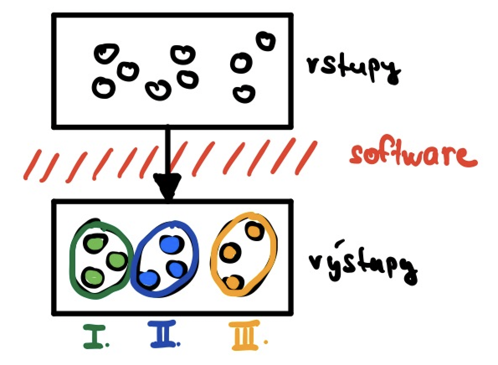
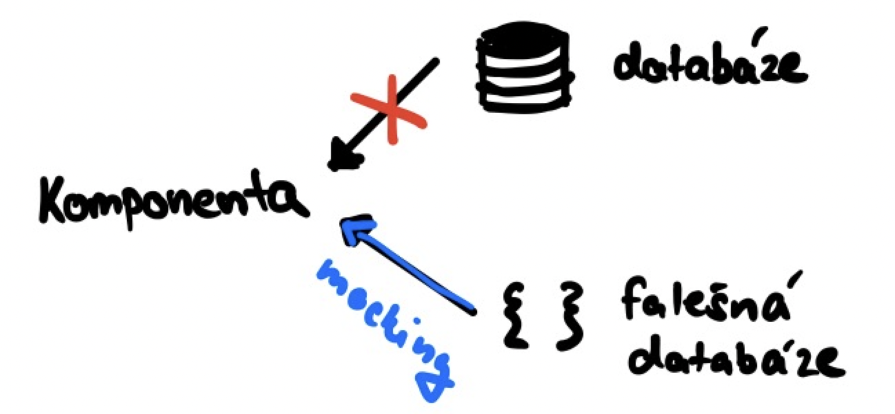
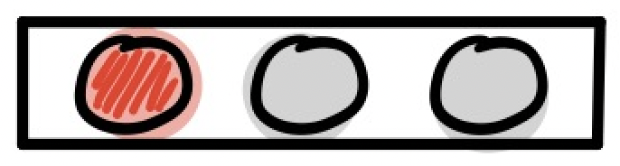

# Softwarové inženýrství

## Seminář 1 - Proces vývoje softwaru

Dnešní společnost na počítačích a jejich aplikacích závislá čím dál více. Vzdělávání online pomocí MS Teams a LMS Moodle, komunikace na projektu v Slack, řízení projektů v ClickUp, integrovaný software kontrolující chování automobilu, psaní přítelkyni/milence/milencovi přes Instant Messaging aplikaci, atd. Mohli bychom výčtem pokračovat do nekonečna. Čím více jsme na technologii závislí, tím více od ní vyžadujeme, aby byla dependabilní, tedy aby poskytovala služby v takové kvalitě, se kterými budeme spokojeni. Určitě si z hlavy vzpomenete na spousty počítačových aplikací, které zrovna dependabilní nejsou (zabugované videohry, zasekané vývojové prostředí, Windows ...).

Inženýrství je discplína, která se zabývá metodickým postupem jak navrhovat a implementovat produkt v požadované kvalitě. Softwarové inženýrství se tedy zabývá tím, jak vytvářet (nebo upravovat) takový software, aby byl dependabilní. Metodický postup, tedy návod jak postupovat, nazýváme procesem vývojem softwaru, o kterém bude v této první lekci řeč. Ve zbylých seminářích se blíže podíváte na detailnější metodické postupy k jednotlivým podčástem procesu vývoje softwaru. 

Je nutné podotknout, že software se vyvíjí, nikoliv vyrábí nebo tvoří. To ovlivňuje, do jakého detailu můžeme metodicky zajít.
* Výroba - pokud se dodrží metodika, tak bude pokaždé produkt zcela stejný (výroba automobilu na sériové lince).
* Tvorba - metodika se nedodržuje (nebo zanedbatelně), jelikož cílem je vytvořit pokaždé unikátní produkt (umělec maluje obraz).
* Vývoj - metodika se dodržuje, ale je nutné ji upravit (nastavit parametry) a často improvizovat, tudíž produkt nebude nikdy stejný, ale bude často podobný.

Z tohoto rozdělení nám vyplývá, že při dodržení pouček softwarového inženýrství nezaručíte, že výsledný software bude dependabilní. Proto zkušení vývojáři (analytici, programátoři, testeři) mají vysoké mzdy. Znalosti z tohoto kurzu nevyužijete pravděpodobně pro malé seminární práce, které píšete v hodinách úvodních kurzů nebo závěrečnou kvalifikační práci. Věřím však, že vám budou více než nápomocné pro váš profesní život a případně pro projektové semináře.


### Samostudium před seminářem

#### S1.1 - Proces vývoje softwaru

Proces je sekvence aktivit. Aktivita je nějaká činnost/fáze, která může být sama o sobě proceseme. Proces vývoje softwaru lze rozdělit na různě detailní aktivity. V nejhrubším možném pohledu bude mít každý vývoj následující 4 aktivity:
1. analýza
2. implementace
3. validace
4. evoluce



**Analýza**

Každý vývoj software začíná nějakou obchodní nabídkou. Nějaký člověk má vizi a vyžaduje k tomu vyvinout software. Takový člověk pak kontaktuje specializovanou vývojářskou firmu nebo poskládá tým z různých vývojářů sám. Přenést vizi na programátorské úkoly (požadavky) je však náročné zejména kvůli nutnosti jednoznačnosti požadavků a nekonfliktnosti požadavků. Zde začíná první aktivita procesu vývoje softwaru - analýza požadavků, kterou provádí specializované povolání, nejčasteji zvané IT analytik. Existuje ještě business analytik, který může být využit ještě před IT analýzou nebo během ní. Business analytik zkoumá více podnikovou stránku (jak se bude software vlastně využívat) než IT analytik.

Analýza požadavků je také process a má tudíž vlastní modely procesu analýzy požadavků. Nejznámějším modelem procesů analýzy požadavků je tzv. Inženýrství požadavků, o kterém si budeme povídat v dalším semináři. IT analytik typicky přijde za klientem, probere s nim jeho vizi a udělá závěry o proveditelnosti projektu. Vize může být krásná, avšak neprovidelná nebo pro zaměstnavatele IT analytika nezajímavá z pohledu finanční stránky a náročnosti (vývojářskému týmu mohou chybět znalosti na vyžadované technologie). Pokud je projekt provitelný, tak začne IT analytik s vyjednáváním o požadavcích. Cílem je získat z tzv. stakeholderů (zainteresovaných osob) požadavky na software. Mezi stakeholdery patří typicky zadavatel, uživatelé a investoři. Každý z nich může mít jiné představy o výsledném softwaru, které mohou být i v konfliktu. Pokud jsou v konfliktu, tak se vyjednává o změnách požadavků, kde typicky nejvyšší prioritu dáváme nejdůležitějším stakeholderům. Následně se seznam požadavků zapíše do oficiální dokumentace ve formální podobě (odborně napsáno s využitím klíčových termínů, diagramů, vzorců, ...), která se nazývá Dokumentace specifikace požadavků (Software requirements specification - SRS). Specifikace je aktivita přepsání požadavků do formální podoby. SRS dokumentace se následně předá klientovi ke schválení a začíná se vyvíjet. Kromě požadavků na funkcionality (tzv. funkční požadavky) existují i požadavky na dependabilní vlastnosti (tzv. mimofunkční požadavky). Na mimofunkční požadavky se často zapomíná a mohou být součástí právních sporů, pokud aplikace není dostatečně výkonná nebo dochází k častým selháním.

Ne vždy je však specifikace zcela v pořádku, i když je nekonfliktní a proveditelná. Problém může nastat typicky ve fázi návrhu architektury, kdy architekt usoudí, že požadavky (jak funkční, tak mimofunkční) kladou na architekturu nereálné požadavky. Pak dochází k vyjednávání o změně požadavků z technických důvodů a proto je často fáze návrhu architektury prolnuta s vyjednáváním o požadavcích. U striktně sekvenčně (vysvětlení v následující podkapitole) zadávaných projektech však nebude návrh architektury hrát roli ve vyjednávání o požadavcích a architekt si se situací musí nějak vhodně poradit.

**Implementace**

Další fází procesu vývoje je implementace softwaru, kde dochází k dvou velkým aktivitám. První je již zmiňovaný návrh architektury, kde softwarový architekt navrh jádro aplikace pomocí vhodných diagramů nebo napíše i strukturu kódu (existovala i myšlenka xUML, kdy se vybrané diagramy daly přeložit do kódu, ale ta se příliš neuchytila). Softwarový architekt je člověk, který má za sebou řadu projektů a umí najít podobné vzory ve funkcionalitě a dependabilitě aplikací. Proto i ví na základě své zkušenosti, jaké hlavní komponenty by měl vytvářený software obsahovat a jaká je jich role. Pomůckou pro architekta jsou tzv. architektonické vzory, což jsou typické vzory propojení komponent a jejich poskládání, pro základní typy softwaru.

Po návrhu architektury se programuje kód, tedy implementují se fukcionální požadavky takovým způsobem, aby byly plněny i mimofunkční požadavky. Programátoři se dělí podle tzv. seniority na junior, medior a senior programátory. Junior je začátečník bez velkých zkušeností (nemá za sebou velké projekty), který je mentorován zkušenějším programátorem a implementuje jen dílčí požadavky typu uprav grafiku, přidej formulář, oprav bug. Medior je zkušený programátor, který je samostatný a programuje všechny složitější funkcionality a často zadává práci juniorům. Senior programátor je zkušený programátor, který má za sebou řadu technologicky náročných projektů a implementuje klíčové funkcionality komponent, které architekt navrhl. Často senioři mentorují juniory a spolurozhodují o směru vývoje. 

S rozvojem komplexnosti projektů se na trhu práce vyčlenily i další povolání (medior je také relativně novým termínem). Příkladem může být tzv. tech-lead, který je spíše manažerem než programátorem a jeho hlavním úkolem je vymyslet technologické řešení, tedy jaké komponenty bodou použity. Například bude tým využívat react nebo angular? Bude back-end řešen v Laravelu nebo Nette? Pokud nastanou nějaké technologické problémy během vývoje, tak tech-lead je za ně odpovědný. Oproti architektovi neřeší vlastní komponenty (typicky třídy), ale využívá existující komponenty z knihoven/modulů a oproti senior programátorovi programuje málo, tudíž nemusí být expert na algoritmizaci (často však je, jelikož vznikají ze senior programátorů a architektů). Spolupráci těchto osob řídí projektový manažer v IT, který se stará o dodržování termínů a komunikaci s klientem. Tech-lead se může jednoho dne stát CTO (chief technology officer), který udává technologický směr celého podniku. Technologický směr však již souvisí spíše s obchodní stránkou podniku a jeho strategií cílení na konkrétní segment trhu. U malých firem tyto role splývají.

**Validace**

Po naprogramování funkčních požadavků začíná fáze validace požadavků. V jiné literatuře se tato fáze nazývá testování nebo validace a verifikace. Testování softwaru se rozkládá na tzv. verifikační a validační testování. Kdysi se tyto dvě činnosti prováděly zároveň ve fázi testování, dnes je zvykem verifikační testování provádět již během vývoje samotnými programátory a tak fáze testování je spíše jen o validačním testování. Verifikace je aktivita, při které se ověřuje, že programátor implementuje požadavky správným způsobem. K tomu slouží testovací pracovní rámce, pomocí kterých píše tzv. automatizované testy. Tyto testy ověřují, že naprogramovaná komponenty při vložení různorodých dat vrací předpokládaný výsledek na základě specifikace požadavků (tzv. jednotkové testy a jednoduché integrační testy). Dedikovaní automatizovaní testeři stále mohou být v procesech využívány na verifikaci správné komunikace složitých komponent (tzv. integrační testy a komponentní testy). Validační testování je o manuálním testování požadavků a vyhledávání míst ke zlepšení v kódové bázi. K tomu se zpravidla žádné testy napíšou. Proto je validační testování typickou vstupní pozicí do světa vývoje softwaru. Validace končí třemi specifickými validačními aktivitami a to alfa-testováním (testování produktu s daty podobnými realitě na platformě vývojářů), beta-testováním (testování produktu s daty podobnými realitě na platformě klienta) a předávacím testování, při kterém se u klienta software zkouší, zda splňuje všechna očekávání a může se klientovi předat.

**Evoluce**

Proces vývoje předáním softwaru nekončí. Klient si často uvědomí, že některé požadavky zapomněl uvést, nebo naopak nějaké nové vznikly v průběhu využívaní předaného softwaru. V takové situace může vzniknout požadavek na doprogramování funkcionalit. Této fázi se říká evoluce softwaru. Programátoři implementují nové požadavky, optimalizují stávající kód technikou refaktorizace nebo dokonce mohou celý projekt přeprogramovat technikou reinženýring (v případě starých projektů). Ve fázi evoluce se typicky objeví projekt pomocí smlouvy na nové požadavky nebo mají vývojáři uzavřenou smlouvu o podpoře. Také se některé projekty mohou dostat do aktivity evoluce díky tomu, že nejsou programátoři zcela spokojeni s původním výtvorem a chtějí ho nadále upravovat. Tyto úpravy znáte pod pojmem záplata (patch) a představují způsob, jak si udržovat dobrou vývojářskou pověst.

Správně nastavený proces vývoje softwaru vám přinese následující výhody:
1. snížení potřebného času na vývoj
2. snížení nákladů na vývoj
3. zvýšení kvality softwaru

#### S1.2 - Modely procesu vývoje softwaru

Obdobně jako softwary mají své archnitektonické vzory, tak i procesy vývoje softwaru jsou si často podobné. Moděl procesu vývoje softwaru je abstrakce procesu vývoje softwaru. Neobsahuje tedy všechny detaily, které si již musí vývojářský tým nastavit.

**Iterativnost modelů**

Důležitou vlastností modelů procesu vývoje softwaru je jejich iterativnost. Iterace je cyklus, během které se vyvine určitá verze výsledného produktu a předá se klientovi. Klient na základě této verze navrhne nové požadavky, který tým v další iteraci implementuje. Pokud je iterace za celý vývoj pouze jedna, pak se jedná o sekvenční model. Modely, které mají mnoho iterací, budeme nazývat iterační modely. Velké množství iterací přenáší část zodpovědnosti na klienta, což se nemusí mnoha klientům líbit, a také jsou daleko hůře říditelné běžnámi manažerskými technikami. Na druhou stranu, se jakékoliv nejasnosti mohou po iteraci vyjasnit a projekt může být klientem vhodně nasměrován. Iterativní modely by měly být úspěšnější, avšak používají je spíše menší týmy bez hierarchie. Velké zakázky jsou typicky sekvenční. Iterativnost je jeden ze způsobů, jak zvýšit ohebnost (agilitu) procesu vývoje softwaru. Proto se iterativní modely a agilní vývoj staly synonymy.

**Sekvenční metodiky**

Nejznámějším příkladem implementace sekvenčního modelu vývoje softwaru je vodopádový model (je to ale spíše metodika). Vodopádový model obsahuje za sebou jdoucí aktivity z procesu vývoje softwaru, které se jen částečně nebo vůbec nepřekrývají. Takový projekt se dobře řídí, jelikož projektový IT manažer ví, jak daleko jsme v projektu, kolik jaká aktivita z procesu stála, aj. Problém nastane v situaci, kdy se opomene nebo špatně pochopí kritický funkcionální požadavek ve fázi analýzy softwaru. To může způsobit nutnost zahození větší části kódové báze, jelikož proces není agilní. To způsobí velkou časovou i finanční újmu (věřím, že i psychologickou). Úspěch vodopádového modelu je značně závislý na kvalitní analýze požadavků.



Mezi další zajímavé spíše sekvenční metodiky vývoje řadíme:
1. V-model
2. Jednotný proces od firmy Rational (Rational Unified Process, RUP)
3. Pomalé programování (Slow programming)

**Iterativní metodiky**

Metodiky vycházející z iterativního modelu jsou typické krátkými iteracemi, kde se střídají krátké aktivity analýzy požadavků v aktuální iteraci, implementace těchto požadavků a jejich validování. Následně se vydá nová verze. Typicky se velice rychle naprogramuje minimálně použitelné produkt (minimal viable product, MVP), který se vydá a v iteracích se obohacuje o další implementované požadavky. Délka iterací se podle metodik může lišit. Nejznámějším příkladem iterativních metodik vývoje softwaru je Scrum a Extrémní programování (XP). Tyto metodiky jsou důležité a proto si je trošku více rozepíšeme v následující kapitole.

Mezi další zajímavé spíše iterativní metodiky vývoje řadíme:
1. Rychlý vývoj aplikací (Rapid Application Development, RAD)
2. Boehmův spirálový vývoj 
3. Kanban



**Manifest agilního vývoje softwaru**

Iterativní model vývoje je jeden ze způsobů, jak mít proces vývoje agilní. Agilní vývoj jako takový je určité filosofické hnutí vývoje, které definuje jeho manifest:
1. jednotlivci a interakce mají přednost před procesy a nástroji
2. fungují software má přednost před obsáhlou dokumentací
3. spolupráce se zákazníkem má přednost před smluvním vyjednáváním
4. reagování na změny má přednost před postupováním podle plánu

Pokud proces vývoje softwaru a vývojářský tým preferuje hodnoty na levé straně vyjádření, pak se jedná o agilní typ vývoje.

#### S1.3 - Scrum

Scrum se překládá do češtiny jako mlýn, ale asi by vám nikdo ve firmě nerozuměl :). Budeme se tedy držet anglického termínu scrum. Jedná se o v dnešní době nejpoužívanější metodiku vývoje softwaru. V této metodice se setkáme s následujícmi rolemi:
* vlastník produktu (product owner)
* pán mlýna :) (scrum master)
* vývojáři

Vlastní produktu je reprezentat všech zainteresovaných osob a chrání jejich zájmy. Tyto zájmy chrání tím, že určuje, které požadavky se v tzv. produktovém backlogu mají prioritně provést určováním priorit. Mezi jeho úkoly patří:
1. určovat priority požadavků, rozsah projektu a financování
2. demonstrovat nové verze produktu zainteresovaným osobám
3. komunikovat se zainteresovanými osobami stav projektu a týmu

Scrum master je osoba, která je odpovědná za odstraňování překážek vývojářů stíněním týmu od externích vlivů. To provádí dohadováním se s product ownerem, organizuje týmové schůzky, vede a podporuje vývojáře, dohlíží na dodržování scrum procesu.

Pro dobře fungující scrum je nutné mít menší tým vývojářů. Dobré kritérium je takové, že tým musí být natolik malý, aby se nasytil ze dvou pizz, tedy 5-7 lidí nejčastěji. Existují i pokusy o větší scrumy s hierarchií, kde scrum masteři mají své scrum mastery (scrum scrumů, mlýn mlýnů? :) ...).

Role scrum mastera a product ownera mají vlastní certifikace, jelikož jejich úkoly jsou značně náročné a obsahují manažerské činnosti.

Během vývoje pracuje tým s následujícími artefakty:
1. produktový zásobník (product backlog) - obsahuje všechny funčkní požadavky zainteresovaných osob, které jsou prioritizované vlastníkem produktu
2. zásobník sprintu (sprint backlog) - obsahuje funkční požadavky na software pro aktuální sprintovou iteraci
3. softwarový přírůstek (software increment) - představuje předchozí vydanou verzi softwaru rozšířenou o implementované požadavky z aktuální sprintové iterace

Kromě toho je užitečné přidat další artefakty, které rozšiřují scrum:
4. graf vyhoření (burndown chart) - liniový graf, který ukazuje zbývající práci v čase
5. definice hotového (Definition of Done, DoD) - definice podmínek, které musí být splněny, aby byl požadavek považován za úspěšně implementovaný (například kód projde regresními testy)
6. rychlost (velocity) - aktuálně nedoporučovaný artefakt, který ukazuje, jak rychle tým vyvíjel v minulém sprintu oproti aktuálnímu, může být vhodný pro pochopení vlastní kapacity vývoje, avšak zneužitelný zainteresovanými osobami, který chtějí software rychle a levně
7. špička (spike) - striktně časově ohraničený úsek vývoje, kdy tým může zkoumat technologie a přijít s prototypem, který je důležitý pro rozhodnutí o vývoji



Proces této metodiky vypadá zhruba takto:
1. plánování sprintu - nejprve se naplánuje pro aktuální iteraci (=sprint), co se bude programovat za požadavky z produktového zásobníku do zásobníku sprintu
2. spuštění sprintu - následně se programují požadavky ze sprintového zásobníku po nastavenou dobu iterace (typicky 2 až 4 týdny)
3. denní scrum - každý den na cca 15 minut se sejde celý tým (všichni stojí kvůli holistickému přístupu), vedene ho scrum master a vývojáři se snaží odbourat překážky vývoje
4. vydání inkrementu - po uběhnutí doby iterace se vydá nový inkrement softwaru
5. sprint review - výsledný obohacený produkt je představen zainteresovaným osobám pro získání zpětné vazby o požadavcích
6. sprint retrospektiva - tým se poučí ze svých chyb a přijde na možné zlepšení pro další iteraci




#### S1.4 - Extrémní programování (autor Kent Beck)

**Co je to extrémní programování?**

Extrémní programování je jedna z iterativních metodik, jejíž filosofie je následující: "Co funguje provádějme do extrému". Pokud jednotkové testy zlepšují kód, pojďme udělat z jednotkových testů základ naší kódové báze. Krátké iterace zvyšují agilitu procesu vývoje? Pojďme je zkrátit na dny i hodiny. Komunikace s kolegou o přestávkách zvyšuje schopnost sdílet znalosti? Pojďme rovnou zavést programování ve dvojicích. Pokud někomu o svém návrhu na implementaci požadavku vyprávím, tak si lépe uvědomuji, jak moje implementace funguje? Pojďme si přinést gumovou kačenku ke každému počítači a vyprávějmě ji o našem kódu. Hádání se o tom, koho chyba je pomalý softwaru, k ničemu nevede? Pojďme zavést společnou odpovědnost za všechny partie softwaru. Přeci jen může kdokoliv chybu jiného napravit. Zhruba tímto způsobem se ubírat směr extrémního programování. Metodika již není příliš používaná, avšak přinesla spousty užitečných technik, které si některé metodiky přebírají:
1. vývoj řízený testy (Test-Driven Development, TDD)
2. párové programování (pair programming)
3. debugování s gumovou kachničkou (rubber duck debugging)
4. společná odpovědnost za kódovou bázi
5. refaktorizace kódu jiných bez nutnosti svolení
6. krátké iterace v řádu dnů až hodin
7. zákazník se nachází v pracovišti vývojářů pro ujasnění nejasností

Pro extrémní programování je velice důležitá zpětná vazba (to souvisí i s tím, že zákazník je na pracovišti vývojářů). Pokud se podíváme na rychlost získávání zpětné vazby, tak nám dojde, jak jsou některé koncepty extrémního programování důležité.



**Verifikace softwaru testy**

Nejzajímavější technikou je vývoj řízený testy. Tato technika vývoje spočívá v tom, že aplikace se skládá z testů a kód představuje pouze způsob, jak tyto testy splnit. 

```
def secti(a: float, b: float) -> float:
    return a + b
```

Testové případy (test cases) často organizujeme podle pracovního rámce AAA (arrange-act-assert), tedy připrav vstupní data, spusť funkci se vstupními daty a ověř správný výsledek.

```
def test_secti_dve_nenulova_desetinna_cisla():
    #arrange - připrav
    a, b = 2, 3
    
    #act - spusť
    navratova_hodnota = secti(a=a, b=b)

    #assert - ověř
    assert navratova_hodnota == 5
```

Testové případy se člení do testových souborů (test suites).

```
def test_secti_dve_nenulova_desetinna_cisla():
    a, b = 2.1, 3.2
    navratova_hodnota = secti(a=a, b=b)
    assert navratova_hodnota == 5.3

def test_secti_dve_nulova_desetinna_cisla():
    a, b = 0.0, 0.0
    navratova_hodnota = secti(a=a, b=b)
    assert navratova_hodnota == 0.0

def test_secti_zaporne_a_kladne_desetinne_cislo():
    a, b = -1.0, 2.0
    navratova_hodnota = secti(a=a, b=b)
    assert navratova_hodnota == 1.0

def test_secti_kladna_cela_cisla():
    a, b = 1, 2
    navratova_hodnota = secti(a=a, b=b)
    assert navratova_hodnota == 3
```

Testových případů by mělo v testovacím souboru tolik, abychom pokryly všechny domény ekvivalence. Doména ekvivalence je  množina vstupních hodnot, na které program reaguje stejným způsobem. Uznávám, že tato definice se mi příliš nepovedla, takže pojďme si to vysvětlit na příkladu. Pokud vložím do naší funkce ```secti(a:float, b:float) -> float``` vstupy ```(2.5, 3.1)``` a vstupy ```(5.1, 6.7)```, tak budu očekávat podobné chování, které nemusím již dále testovat. Rozdílné chování může být v situacích, kdy vložím jiný datový typ: ```(2.1, 3)```, ```(2, 3)```, ```("2", "3")``` nebo extrémní hodnoty typu nula a nekonečna.



**Možnosti testových pracovních rámců**

Testové případy se spouští podprogramem, který nazýváme spouštěč testů (testrunner), kde se testy z testových souborů registrují.

```
def testrunner():
    test_secti_dve_nenulova_desetinna_cisla()
    test_secti_dve_nulova_desetinna_cisla()
    test_secti_zaporne_a_kladne_desetinne_cislo()
    test_secti_kladna_cela_cisla()
```

Testrunnery testovacích frameworků se typicky spouští z příkazové řádky a obsahuje spousty možností zadání argumentů příkazové řádky, které ovlivňují výsledné chování. Příklady těchto možností:
1. vyhodnocení pokrytí kódu testy
2. spuštění testů zadaných typů (markings)
3. detailní/skromné výpisy detailů selhání
4. spuštění testů z určené cesty
5. spousty dalších užitečných nastavení ...

Pro automatizované testování reálných aplikací budete muset často připravit vstupní data například z databází, webových stránek a jiných zdrojů. Pro zjednodušení procesu testování tato vstupní data podvrhujeme. Přípravě těchto "falešných" vstupů se říká test fixture. Testovací frameworky tyto schopnosti mají naprogramované, čímž se vám zjednoduší celý proces testování. 

Mezi další zajímavé techniky, které testovací frameworky (pytest, unittest) nabízí jsou:
* mocking = nahrazení komponent falešnou komponentou (např. třídou), na který je testovaná komponenta závislá
* stubbing = to samé jako mocking, ale nahrazujeme falešnou komponentou s minimální nutnou implementací
* fixtures = funkce, které se spustí před fází akt z procesu AAA a mění stav aplikace (např.: připojí se a uloží data do databáze)
* monkey patching = technika pro modifikaci implicitního chování komponenty za běhu (např.: pokud komponenta získává data z internetu, tak to zamezim a vrátím ji lokální data)



**Proces vývoje softwaru řízeného testy**

Teď již víme, co obnáší testování. Pojďme si vysvětlit, jak vypadá vývoj řízený test. Při vývoji řízeném testy se držíme tzv. semaforu RGR, red-green-refactor. Proces začíná tím, že si nejprve napíšeme první test a zaregistrujeme si ho. Kód nemá zatím žádnou implementaci. Překlad/interpretace programu selže, jelikož testovaná funkce nemá implementaci a ověření správného výstupu selže. Jsme ve stavu červená na semaforu.

```
def secti(a: float, b:float) -> float:
    ...

def test_secti_dve_nenulova_desetinna_cisla():
    a, b = 2.0, 3.0
    navratova_hodnota = secti(a, b)
    assert navratova_hodnota == 5.0
```

Naším cílem je dostat se nejrychlejší a nejjednodušší možnou cestou do stavu zelená na semaforu. Tohoto stavu dosáhneme tak, že se kód spustí. Musíme tedy napsat implementaci testované funkce tak, aby prošla testy.



```
def secti(a: float, b:float) -> float:
    return 5.0

def test_secti_dve_nenulova_desetinna_cisla():
    a, b = 2.0, 3.0
    navratova_hodnota = secti(a, b)
    assert navratova_hodnota == 5.0
```

Teď již půjde kód spustit a jsme v barvě zelené. Následuje proces refaktorizace, při kterém uvažujeme, jak kód vylepšit. Kód však musí stále procházet právě prošlým testem. Pokud nevíme jak kód vylepšit, pak nám může pomoct napsání dalšího testového případu, ze kterého vzejdou nápady na refaktorizaci.


```
def secti(a: float, b:float) -> float:
    return 5.0

def test_secti_dve_nenulova_desetinna_cisla():
    a, b = 2.0, 3.0
    navratova_hodnota = secti(a, b)
    assert navratova_hodnota == 5.0

def test_secti_dve_nulova_desetinna_cisla():
    a, b = 0.0, 0.0
    navratova_hodnota = secti(a, b)
    assert navratova_hodnota == 0.0
```

Tímto testem jsme se opět dostali do červené barvy a je nutné se dostat do zelené.


```
def secti(a: float, b:float) -> float:
    if a == 2.0: 
        return 5.0
    else:
        return 0.0

def test_secti_dve_nenulova_desetinna_cisla():
    a, b = 2.0, 3.0
    navratova_hodnota = secti(a, b)
    assert navratova_hodnota == 5.0

def test_secti_dve_nulova_desetinna_cisla():
    a, b = 0.0, 0.0
    navratova_hodnota = secti(a, b)
    assert navratova_hodnota == 0.0
```


Jsme opět v zelených barvách a můžeme přemýšlet nad refaktorizací. Refaktorizaci provádíme typicky tehdy, když se náš myšlenkový postup opakuje 2 a vícekrát.

```
def secti(a: float, b:float) -> float:
    return a + b

def test_secti_dve_nenulova_desetinna_cisla():
    a, b = 2.0, 3.0
    navratova_hodnota = secti(a, b)
    assert navratova_hodnota == 5.0

def test_secti_dve_nulova_desetinna_cisla():
    a, b = 0.0, 0.0
    navratova_hodnota = secti(a, b)
    assert navratova_hodnota == 0.0
```


Kód je refaktorován a můžeme psát další test. Tento cyklus opakujeme, dokavaď neskončí pracovní den nebo není projekt plně hotov :).

### On-site cvičení

V tomto cvičení si vyzkoušíte vyvíjet jednoduchý softwaru pomocí kombinovaného a upraveného procesu vývoje softwaru, který zahrnuje prvky z metodiky Scrum a XP. Budete vyvíjet jednoduchý software, kde požadavky od product ownera jsou již dodané a vybrané na aktuální sprint. Výstupem dnešního semináře je změřit si burndown chart s ideálním.

Budete mít k dispozici následující artefakty:
1. produktový backlog s požadavky
2. definice hotového
3. graf vyhoření

Proces bude vypadat následovně:
1. na začátku je daily scrum meeting se mnou jako scrum masterem
2. vývoj bude řízený testy (bez testovacího pracovního rámce, jen příkaz assert)
3. párové programování + debugování s gumovou kachničkou (dodám)
4. požadavky z backlogu zapisujete na kanban tabuli
5. měříte svůj postup na grafu vyhoření
6. iterace trvá 90 minut

Kanban tabuli s měřením grafu vyhoření můžete nalézt například v aplikace ClickUp pro správu projektů. Bohužel graf vyhoření je k dispozici pouze v placené verzi. Ačkoliv do vás nemám problém investovat, tak v ClickUpu se platí za osobu v týmu a to už se mi trošku nevyplatíte :). Z toho důvodu jsem to vymyslel následovně:

1. Ve složce ```sem1/soubory``` v tomto repozitáři naleznete produktový backlog ve formátu csv. Tento soubor si můžete naimportovat do libovolného tabulkového kalkulátoru (např.: Excel, Calc, Google tabulky). Jedná se o soubor s názvem ```kanban.csv```.
2. Buď si nalezněte nějakou aplikaci pro kanban tabuli (spousty softwaru pro zápis myšlenek lze zneužít) nebo zneužijte tabulku s backlogem jako Kanban tabuli (je to tam již pro vás připravené). Pro autentický zážitek však doporučuji používat Kanban v softwaru ClickUp
3. Ve složce ```sem1/soubory``` se také nachází csv soubor s mnou naměřeným burndown grafem na úkolech z produktového backlogu s názvem ```burndown.csv```. Tento soubor si otevřete v tabulkovém kalkulátoru a zapisujte si do něj údaje o plnění funkcionalit. Svoje data jsem aproximoval lineární funkcí.
4. Programujte pomocí vývoje řízeného testy funkcionality z produktového backlogu ve dvojicích (párové programování).
5. Vždy po dokončení funkčního požadavku vysvětlete váš kód gumové kachničce (k dispozici u mě k vyzvednutí, po semináři vrátit!).
6. Přesouvejte požadavky do správných sloupečků na kanban tabuli.
7. Na konci hodiny mi ukažte váš burndown chart v porovnání s mým.

Soubory si můžete stáhnout i zde:
<ul>
    <li><a href="./soubory/kanban.csv">kanban</a></li>
    <li><a href="./soubory/burndown.csv">burndown</a></li>
</ul>